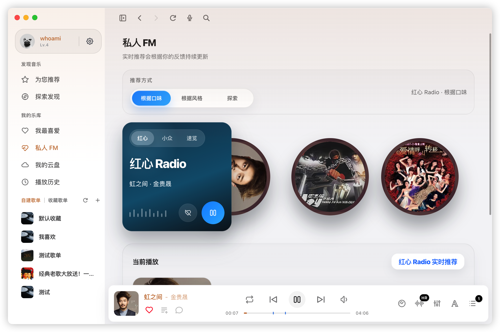
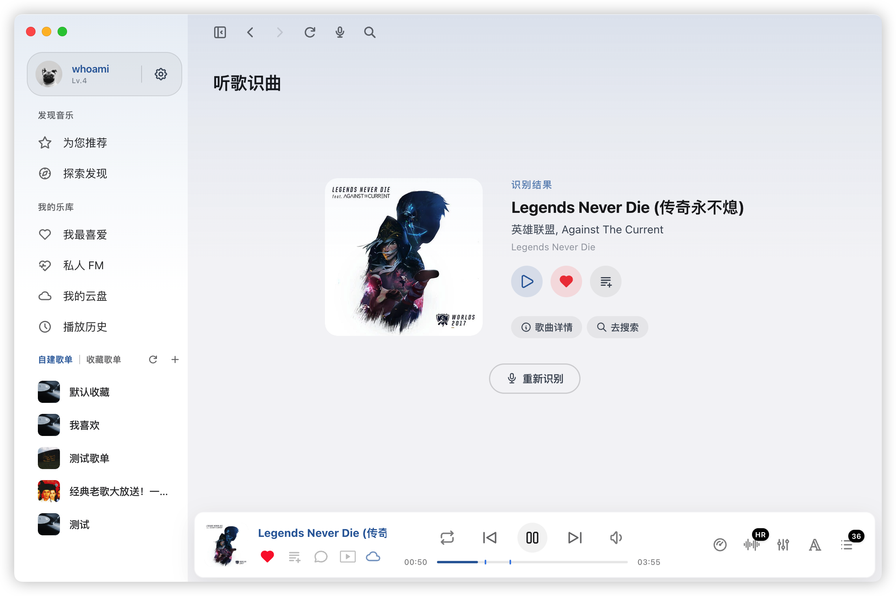

# EchoMusic

<p align="center">
  
</p>

<p align="center">
  <strong>EchoMusic</strong> —— 一个专为桌面端打造的简约、精致、功能强大的第三方音乐播放器。
</p>

<p align="center">
  
  
  
  
  
  
</p>

---

## ✨ 核心特性

- **极致美学**：精心适配桌面端布局，支持深浅色模式与主题色自定义，完美兼顾信息密度、个性表达与沉浸式体验。
- **数据安全**：官方服务器直连，数据不经过第三方服务器，保证用户数据安全。
- **音乐推荐**：支持歌曲、歌单、歌手、专辑、排行榜等内容推荐。
- **多维探索**：支持歌曲、歌手、专辑、歌单、歌词、MV 全方位搜索，快速发现心仪旋律。
- **外部歌单导入**：支持网易云、QQ 音乐、酷我、酷狗、汽水、Spotify、Apple Music 及文本歌单导入。
- **进阶播放**：支持播放队列管理、播放模式切换、音量调节、进度拖动、倍速播放、淡入淡出切歌等核心播放能力。
- **私人 FM**：智能推荐个性化电台，发现更多好音乐。
- **音乐云盘**：支持本地音频和跨平台文件导入，快速将专属音乐同步至云端存储。
- **听歌识曲**：支持麦克风和系统音频捕获，快速识别正在播放的歌曲。
- **歌曲详情**：支持查看歌曲档案及播放详情。
- **分享功能**: 支持将你喜欢的歌曲、歌单、专辑、歌手、插件一键分享给好友或社交平台。
- **歌曲评论**：支持查看歌曲评论与评论楼层跳转。
- **歌词显示**：支持 LRC/YRC 逐字歌词解析、歌词选择、歌词翻译、正则过滤、滚动同步、全屏歌词、写真模式、桌面歌词。
- **音频增强**：支持 10 段参数化 EQ 均衡器（带自动增益补偿）、音量均衡（基于 LUFS 响度标准化）、导入式空间音效（高效 IR 卷积、Dry/Wet 混合控制）与多种音效模式。
- **实时频谱分析**：直接从播放引擎提取音频数据，使用 FFT 进行实时频谱分析，为插件 `ctx.audio.spectrum` 提供低延迟、高精度的频谱帧。
- **系统媒体控制**：原生集成 macOS MPNowPlayingInfoCenter、Windows SMTC、Linux MPRIS，支持系统媒体按键和进度同步。
- **系统集成**：支持窗口控制、系统托盘、托盘快捷控制、全局快捷键、开机自启动、启动时最小化和 mini 模式。
- **音频设备**：支持切换音频输出设备、独占模式输出。
- **插件扩展**：支持在线插件源浏览安装与本地插件加载，自定义页面、侧边栏入口、设置项、播放器按钮、歌曲右键菜单与播放事件监听。
- **持久化能力**：支持设置、播放历史、收藏、播放状态等本地持久化。
- **跨平台支持**：完整适配 macOS、Windows 与 Linux 系统。
- **自动更新**：内置应用更新检测与下载，支持静默更新。
- **持续集成**：完善的 GitHub Actions 配置，支持多平台自动构建与 Release 发布。

## 音质音效

- **音质**：DSD臻品音质、Hi-Res、SQ(flac)、HQ(320)、标准(128)
- **音效**：人声、伴奏、钢琴、骨笛、尤克里里、唢呐、DJ、蝰蛇母带、蝰蛇全景声、蝰蛇超清
- **高级音频处理**：
  - **10 段参数化 EQ**：60Hz - 16kHz 精细控制，自动增益补偿，支持预设（流行、摇滚、古典、电子等）
  - **优化的空间音效**：高效 FFT-based 卷积混响、IR 预处理和归一化、Dry/Wet 混合级别控制，支持导入自定义空间脉冲响应文件
  - **统一滤镜链管理**：智能管理 EQ、混响、音量均衡等多重音频效果，避免冲突，确保最佳音质

## 🛠️ 技术栈

- **Desktop Shell**: [Electron](https://www.electronjs.org/) 42.3
- **Frontend**: [Vue 3.5](https://vuejs.org/) + [TypeScript 5.9](https://www.typescriptlang.org/)
- **Build Tool**: [Vite](https://vitejs.dev/) 8
- **State Management**: [Pinia](https://pinia.vuejs.org/) + [pinia-plugin-persistedstate](https://prazdevs.github.io/pinia-plugin-persistedstate/)
- **UI Primitives**: [Reka UI](https://reka-ui.com/)
- **CSS**: [Tailwind CSS](https://tailwindcss.com/) v4.3
- **Routing**: [Vue Router](https://router.vuejs.org/)
- **Package Manager**: [pnpm](https://pnpm.io/)
- **Backend Service**: [Node.js](https://nodejs.org/)（内置本地服务，进程内直接调用）
- **Audio Engine**: FFmpeg 解码 + SoundTouch 变速处理 + 原生音频输出（通过 Rust NAPI addon 进程内嵌入）
- **Native Addons**: [napi-rs](https://napi.rs/)（Rust 编写的原生扩展）
  - `echo-ffmpeg-player`：播放引擎封装，使用 vendored `ffmpeg-audio` 与 `soundtouch-rs`，支持淡入淡出、EQ、音量均衡、倍速播放、输出设备切换、独占输出与实时频谱分析
  - `echo-media-controls`：系统媒体控制集成（macOS/Windows/Linux 原生 API）
  - `echo-sqlite-store`：SQLite 本地持久化存储，负责设置、播放队列与状态快照

## 🖼️ 界面截图

- 首页
  
- 发现
  
- 私人FM
  
- 听歌识曲
  
- 歌词
  
- 歌曲详情
  
- 歌曲评论
  
- 播放列表
  
- 专辑
  
- 歌手
  
- 搜索
  
- 个人中心
  
- 设置
  

## 🚀 快速开始

### 前置要求

- [Node.js](https://nodejs.org/) 18+
- [pnpm](https://pnpm.io/) 9+
- [Rust](https://www.rust-lang.org/)（编译原生模块需要）
- FFmpeg 开发库（编译播放引擎原生模块需要；运行时不依赖外部 `ffmpeg` 可执行文件）

### 本地开发

1. **克隆仓库**

   ```bash
   git clone https://github.com/hoowhoami/EchoMusic.git
   cd EchoMusic
   git submodule update --init --recursive
   ```

2. **安装依赖**

   ```bash
   pnpm install
   cd server && npm install && cd ..
   ```

   在Linux下，可能会出现如下报错:

   ```bash
   Error: ENOENT: no such file or directory, open '/home/xxx/Projects/Work/EchoMusic/node_modules/electron/path.txt'
   ```

   需手动下载并解压Electron到对应目录：

   ```bash
   cd node_modules/.pnpm/electron@42.3.1/node_modules/electron/
   mkdir -p dist
   curl -L -o /tmp/electron.zip "https://npmmirror.com/mirrors/electron/v42.3.1/electron-v42.3.1-linux-x64.zip"
   unzip -o /tmp/electron.zip -d dist/
   printf '%s' './electron' > path.txt
   ```

3. **编译 Rust 原生模块**

   倘若出现如下报错:

   ```bash
   Error: Cannot find module '/home/myname/EchoMusic/native/echo-ffmpeg-player/echo-ffmpeg-player.node'
   [error] [PlayerController] Failed to load echo-ffmpeg-player addon
   ```

   需要手动编译 Rust 原生模块，因为 `*.node` 文件在 `.gitignore` 中被排除。推荐使用各 addon 自带的 napi-rs 构建脚本生成平台对应的 `.node`：

   ```bash
   cd native/echo-ffmpeg-player
   pnpm install --ignore-workspace
   pnpm exec napi build --release --no-const-enum

   cd ../echo-media-controls
   npm install
   npm run build

   cd ../echo-sqlite-store
   npm install
   npm run build

   cd ../..
   ```

4. **启动本地开发服务器**

   ```bash
   pnpm dev
   ```

> 开发模式下会由 Electron 主进程自动拉起本地服务端。

## 插件系统

EchoMusic 支持在线插件源浏览安装与本地插件扩展。插件可以提供高自由度的扩展能力，包括自定义页面、音源解析、歌词解析、音频频谱、插件浮窗、本地 Web 服务，以及由 `ctx.lyricEffects.register()` 提供的页面歌词/桌面歌词动效扩展点。

插件声明 `capabilities.webServer: true` 后，可以通过 `ctx.webServer.listen()` 创建仅监听 `127.0.0.1` 的本地 HTTP 服务，供 Wallpaper Engine 等外部软件访问；插件停用、卸载、进入安全模式或应用退出时会自动释放端口。

插件声明 `capabilities.kugouVerification: true` 后，可以把接口返回的 `ssaCode` / `eventId` 交给 `ctx.kugouVerification.request()`；EchoMusic 会复用主程序的安全验证弹窗，验证通过后插件再重试原请求。

```js
export async function activate(ctx) {
  const server = await ctx.webServer.listen(() => ({
    headers: { 'content-type': 'text/html; charset=utf-8' },
    body: '<!doctype html><title>EchoMusic</title><h1>EchoMusic Plugin Page</h1>',
  }));

  if (server.ok) {
    ctx.toast.success(`Web 服务已启动: ${server.url}`);
  }
}
```

👉 **[插件开发文档](https://github.com/hoowhoami/EchoMusicPlugins)**

## 🏗️ 编译发布

项目使用 GitHub Actions 进行自动化构建。每当推送 `v*` 格式的 Tag 时，会自动触发多平台构建并将二进制包上传至 Releases。

**手动编译：**

```bash
pnpm build
```

## 📦 打包产物

- **macOS**：`dmg`、`zip`
- **Windows**：`exe (nsis，x64/arm64)`
- **Linux**：`deb`、`rpm`、`AppImage`、`tar.gz`

## macOS

```bash
xattr -cr /Applications/EchoMusic.app && codesign --force --deep --sign - /Applications/EchoMusic.app
```

## 交流群

- [Telegram](https://telegram.me/+H9vpkAJrDlViZjU1)
- QQ1群: 1036693403（已满，加了会被直接拒绝）
- QQ2群：[491694809](https://qun.qq.com/universal-share/share?ac=1&authKey=XOL9fQGcJA%2FrPnEMB3ye5uizEGZd%2Bd0%2BqXVcoNcsRsE44r%2FTuZxTMpbOEb09sD1c&busi_data=eyJncm91cENvZGUiOiI0OTE2OTQ4MDkiLCJ0b2tlbiI6IlROYm1OblFUc1o2NzBMQVNMWTlmY1QwOVZxU1RuelIvcVB1bzlPVXd0dVB3ZHNBWm0vMEVNZkQzVXFOQ3I0YUoiLCJ1aW4iOiIzNTM4OTA0MDc4In0%3D&data=Wg3hFwudAwgWfojZNMpcyK5KoGydAM9hijUfwcvg-MqqjTepIcVdA0zr5Pnms_fAAgvm_7U3yK8Br9ocKbuQDg&svctype=4&tempid=h5_group_info)

## 💡 灵感来源

本项目受到以下优秀开源项目的启发：

- [KuGouMusicApi](https://github.com/MakcRe/KuGouMusicApi) - 酷狗音乐 NodeJS 版 API
- [SPlayer](https://github.com/imsyy/SPlayer) - 一个简约的音乐播放器
- [ffmpeg-audio](https://github.com/apoint123/ffmpeg-audio) - 基于 FFmpeg 的 Rust 音频解码库
- [soundtouch-rs](https://github.com/apoint123/soundtouch-rs) - Rust 音频变速处理库
- [MoeKoeMusic](https://github.com/MoeKoeMusic/MoeKoeMusic) - 一款开源简洁高颜值的酷狗第三方客户端

## 📄 免责声明

本项目是基于公开 API 接口开发的第三方音乐客户端，仅供个人学习和技术研究使用。

- **数据来源**：所有音乐数据通过公开接口获取，本项目不存储、不传播任何音频文件
- **版权声明**：音乐内容版权归原平台及版权方所有，请尊重知识产权，支持正版音乐
- **使用限制**：禁止将本项目用于任何商业用途或违法行为
- **责任声明**：因使用本项目产生的任何法律纠纷或损失，均由使用者自行承担
- **争议处理**：如版权方认为本项目侵犯其权益，请通过 Issues 联系，我们将积极配合处理

**本项目不接受任何商业合作、广告或捐赠。**

## ⚖️ 开源协议

基于 [GNU General Public License v3.0](https://www.gnu.org/licenses/gpl-3.0.html) 协议发布，完整协议文本见 [LICENSE](LICENSE)。

第三方依赖与授权说明见 [THIRD_PARTY_NOTICES.md](THIRD_PARTY_NOTICES.md)。
