# EchoMusic

<p align="center">
  
</p>

<p align="center">
  <strong>EchoMusic</strong> —— 一个专为桌面端打造的简约、精致、功能强大的第三方酷狗概念版音乐播放器。
</p>

<p align="center">
  
  
  
</p>

---

## ✨ 核心特性

- **极致美学**：基于 Material Design 3 设计，支持深浅色模式，适配桌面端大屏体验。
- **数据安全**：官方服务器直连，数据不经过第三方服务器，保证用户数据安全。
- **音乐推荐**：支持歌曲、歌单、歌手、专辑、排行榜等内容的推荐。
- **多维探索**：支持歌曲、歌手、专辑、歌单全方位搜索，快速发现心仪旋律。
- **进阶播放**：支持高潮片段标记（Firefly 效果）、播放队列管理、淡入淡出、倍速播放、音频设备选择等高级功能。
- **音质音效**：支持指定音质和音效，支持智能兼容模式自动降级，听歌无障碍。
- **歌曲详情**：支持查看歌曲档案及歌曲成绩单。
- **歌曲评论**：支持查看歌曲评论。
- **歌词显示**：支持歌词逐字显示、歌词翻译、歌词音译。
- **跨平台支持**：原生适配 macOS、Windows 与 Linux 系统。
- **持续集成**：完善的 GitHub Actions 配置，支持全平台自动编译与 Release 发布。


## 音质音效

- **音质**：Hi-Res、SQ(flac)、HQ(320)、标准(128)
- **音效**：钢琴、人声伴奏、骨笛、尤克里里、唢呐、DJ、蝰蛇母带、蝰蛇全景声、蝰蛇超清


## 🛠️ 技术栈

- **Frontend**: [Flutter](https://flutter.dev/) (Desktop)
- **State Management**: [Provider](https://pub.dev/packages/provider)
- **Networking**: [Dio](https://pub.dev/packages/dio)
- **Backend Service**: [Node.js](https://nodejs.org/) (Custom built-in server)
- **Persistence**: [Shared Preferences](https://pub.dev/packages/shared_preferences)

## 界面截图

- 首页
  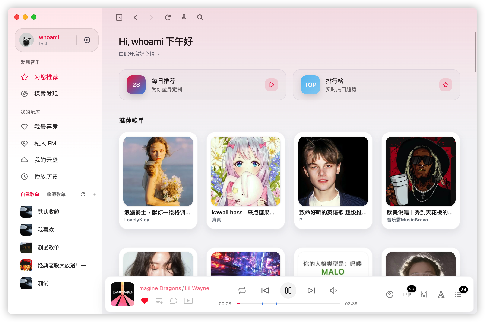
- 发现
  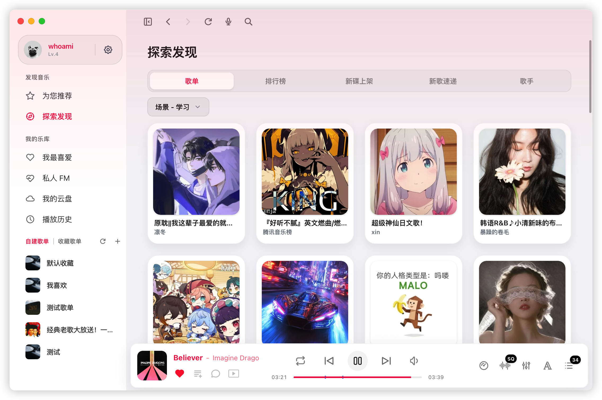
- 歌词  
  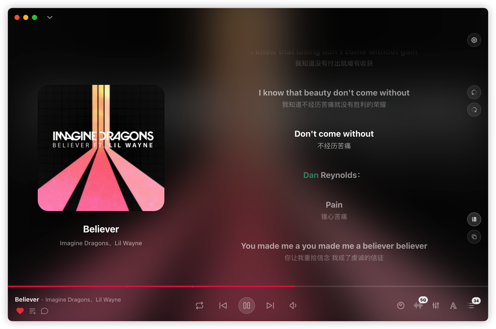
- 歌曲详情
  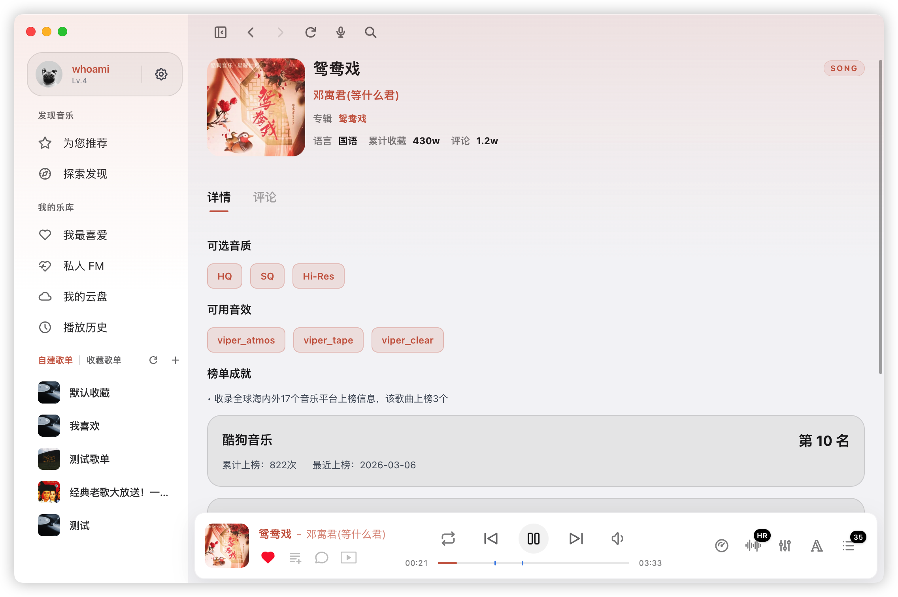
- 歌曲评论
  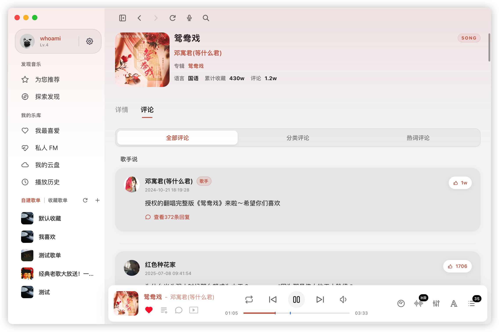    
- 播放列表
  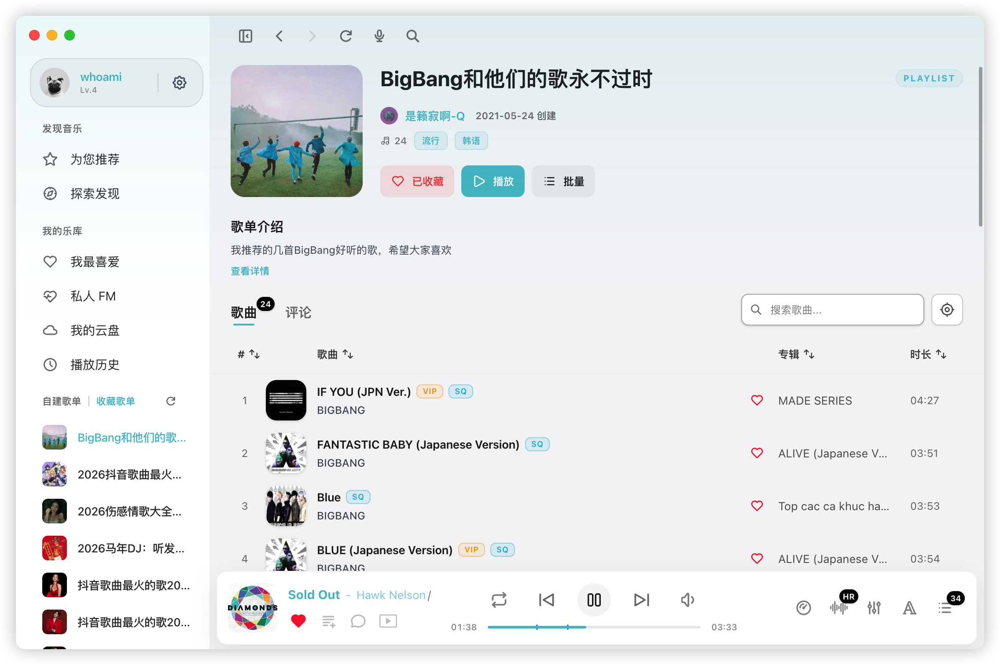
- 搜索
  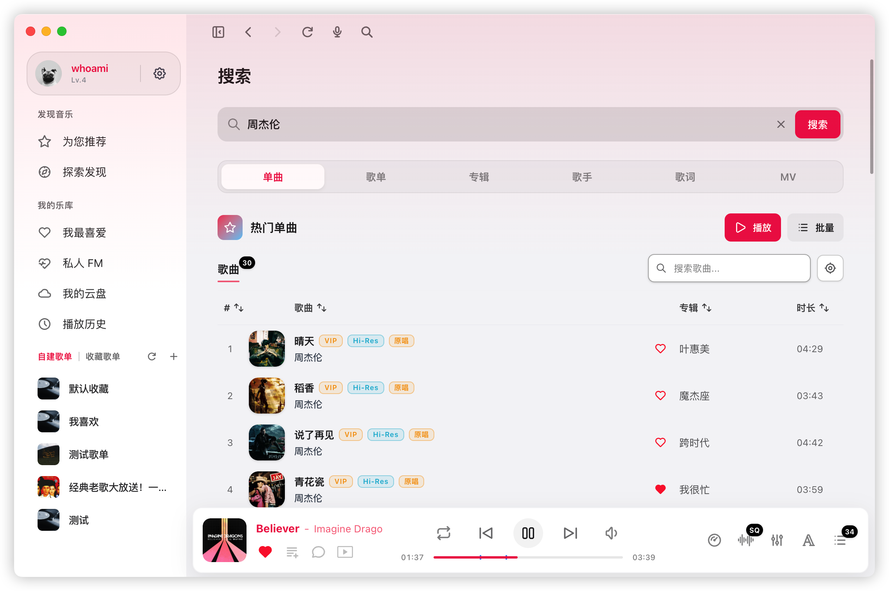
  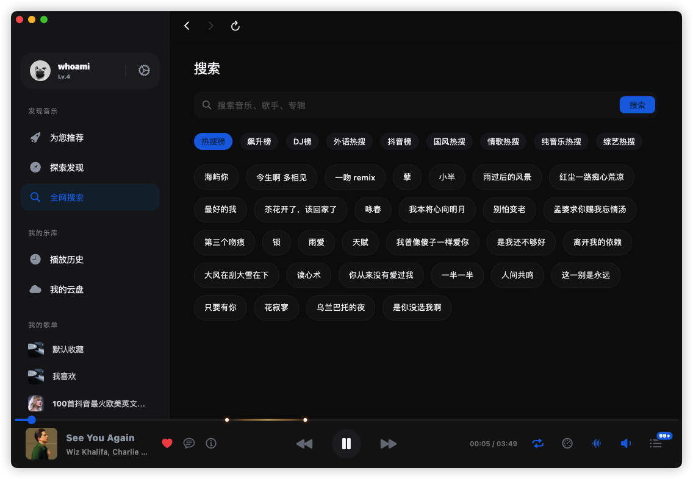
  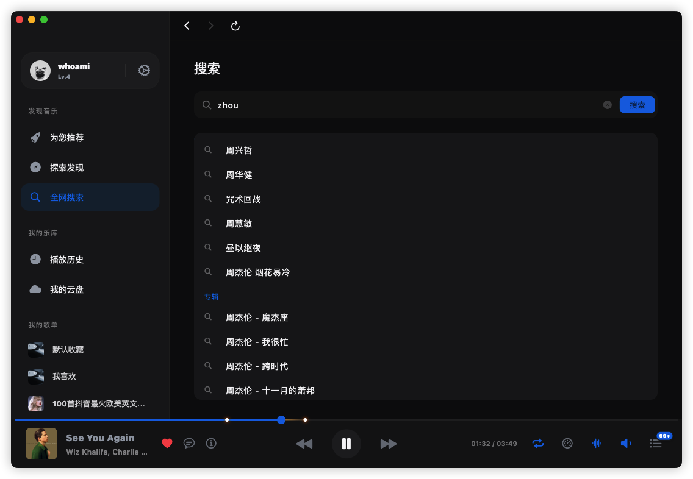  
- 个人中心
  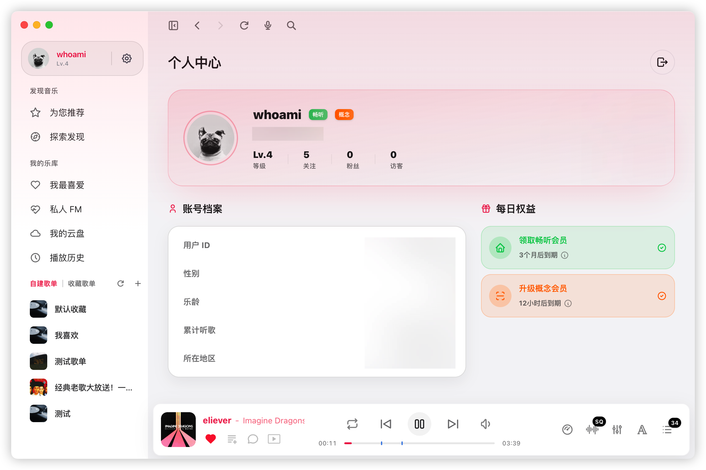  
- 设置  
  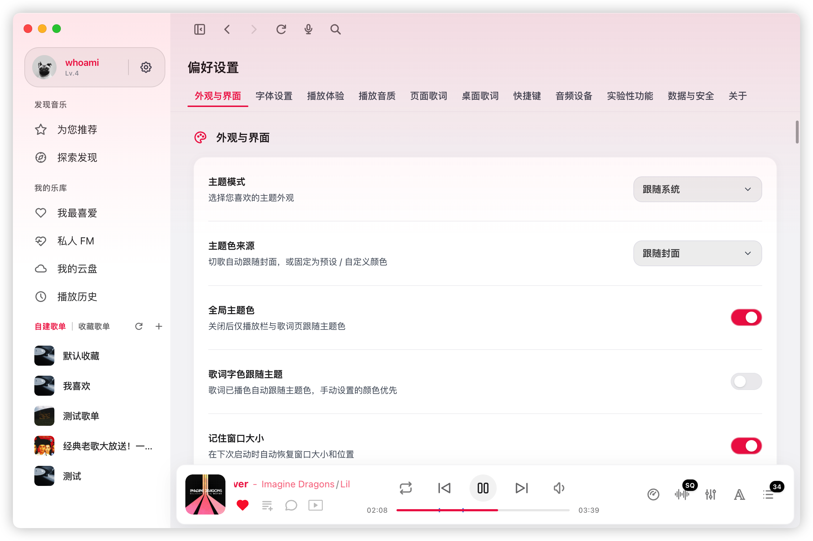


## 🚀 快速开始

### 前置要求

- [Flutter SDK](https://docs.flutter.dev/get-started/install) (推荐最新稳定版)
- [Node.js](https://nodejs.org/) (用于本地服务端依赖)

### 本地开发

1. **克隆仓库**
   ```bash
   git clone https://github.com/hoowhoami/EchoMusic.git
   cd EchoMusic
   git submodule update --init --recursive
   ```

2. **安装服务端依赖**
   ```bash
   cd server
   npm install
   cd ..
   ```

3. **获取 Flutter 依赖**
   ```bash
   flutter pub get
   ```

4. **启动应用**
   ```bash
   # 根据你的系统选择
   flutter run -d macos
   flutter run -d windows
   flutter run -d linux
   ```   

## 🏗️ 编译发布

项目使用 GitHub Actions 进行自动化构建。每当推送 `v*` 格式的 Tag 时，会自动触发多平台构建并将二进制包上传至 Releases。

**手动编译：**
```bash
flutter build macos --release
flutter build windows --release
flutter build linux --release
```

## MacOS

```bash
xattr -cr /Applications/EchoMusic.app && codesign --force --deep --sign - /Applications/EchoMusic.app
```

## 交流群
- [Telegram](https://t.me/+H9vpkAJrDlViZjU1)

## 💡 灵感来源

本项目受到以下优秀开源项目的启发：

- [KuGouMusicApi](https://github.com/MakcRe/KuGouMusicApi) - 酷狗音乐 NodeJS 版 API
- [SPlayer](https://github.com/imsyy/SPlayer) - 一个简约的音乐播放器
- [MoeKoeMusic](https://github.com/MoeKoeMusic/MoeKoeMusic) - 一款开源简洁高颜值的酷狗第三方客户端

## 📄 免责声明

本项目是基于公开 API 接口开发的第三方音乐客户端，仅供个人学习和技术研究使用。

- **数据来源**：所有音乐数据通过公开接口获取，本项目不存储、不传播任何音频文件
- **版权声明**：音乐内容版权归原平台及版权方所有，请尊重知识产权，支持正版音乐
- **使用限制**：禁止将本项目用于任何商业用途或违法行为
- **责任声明**：因使用本项目产生的任何法律纠纷或损失，均由使用者自行承担
- **争议处理**：如版权方认为本项目侵犯其权益，请通过 Issues 联系，我们将积极配合处理

**本项目不接受任何商业合作、广告或捐赠。**

## ⚖️ 开源协议

基于 [MIT License](LICENSE) 协议发布。
<!-- trigger -->
