# EchoMusic

<p align="center">
  
</p>

<p align="center">
  <strong>EchoMusic</strong> —— 一个专为桌面端打造的简约、精致、功能强大的第三方音乐播放器。
</p>

<p align="center">
  
  
  
  
  
  
</p>

---

## ✨ 核心特性

- **极致美学**：精心适配桌面端布局，支持深浅色模式与主题色自定义，完美兼顾信息密度、个性表达与沉浸式体验。
- **数据路径透明**：核心音乐请求由本地服务直接访问对应平台；项目不提供音频中转或云端账号托管。第三方插件具备独立网络能力，安装前请确认来源可信。
- **音乐推荐**：支持歌曲、歌单、歌手、专辑、排行榜等内容推荐。
- **多维探索**：支持歌曲、歌手、专辑、歌单、歌词、MV 全方位搜索，快速发现心仪旋律。
- **外部歌单导入**：支持网易云、QQ 音乐、酷我、酷狗、汽水、Spotify、Apple Music 导入。
- **进阶播放**：支持播放队列管理、播放模式切换、音量调节、进度拖动、倍速播放、淡入淡出切歌等核心播放能力。
- **私人 FM**：智能推荐个性化电台，发现更多好音乐。
- **音乐云盘**：支持本地音频和跨平台文件导入，快速将专属音乐同步至云端存储。
- **听歌识曲**：支持麦克风和系统音频捕获，快速识别正在播放的歌曲。
- **歌曲详情**：支持查看歌曲档案及播放详情。
- **分享功能**：支持将你喜欢的歌曲、歌单、专辑、歌手、插件一键分享给好友或社交平台。
- **歌曲评论**：支持查看歌曲评论与评论楼层跳转。
- **歌词显示**：支持 LRC/YRC 逐字歌词解析、歌词选择、歌词翻译、正则过滤、滚动同步、全屏歌词、写真模式、桌面歌词。
- **音频增强**：内置跨平台音效引擎，支持 10 段均衡器（按完整频响自动前级补偿）、LUFS 响度标准化和 WAV/IRS 空间音效；也可导入兼容音效引擎，扩展更多预设、可调参数与组合音效。
- **实时频谱分析**：直接从播放引擎提取音频数据，使用 FFT 进行实时频谱分析，为插件提供低延迟、高精度的频谱帧。
- **系统媒体控制**：原生集成 macOS MPNowPlayingInfoCenter、Windows SMTC、Linux MPRIS，支持系统媒体按键和进度同步。
- **系统集成**：支持窗口控制、系统托盘、托盘快捷控制、全局快捷键、开机自启动、启动时最小化和 mini 模式。
- **音频设备**：支持切换音频输出设备、独占模式输出。
- **插件扩展**：支持在线插件源浏览安装与本地插件加载，自定义页面、侧边栏入口、设置项、播放器按钮、歌曲右键菜单与播放事件监听。
- **持久化能力**：支持设置、播放历史、收藏、播放状态等本地持久化。
- **跨平台支持**：完整适配 macOS、Windows 与 Linux 系统。
- **应用更新**：内置版本检测与更新日志；支持自动更新的平台可在应用内下载安装，macOS 当前提供 DMG 手动更新入口。
- **持续集成**：完善的 GitHub Actions 配置，支持多平台自动构建与 Release 发布。

## 🛠️ 技术栈

- **Desktop Shell**: [Electron](https://www.electronjs.org/) 43.4
- **Frontend**: [Vue 3.5](https://vuejs.org/) + [TypeScript 5.9](https://www.typescriptlang.org/)
- **Build Tool**: [Vite](https://vite.dev/) 8
- **State Management**: [Pinia](https://pinia.vuejs.org/) + 原生 SQLite 持久化
- **UI Primitives**: [Reka UI](https://reka-ui.com/)
- **CSS**: [Tailwind CSS](https://tailwindcss.com/) v4.3
- **Routing**: [Vue Router](https://router.vuejs.org/)
- **Package Manager**: [pnpm](https://pnpm.io/)
- **Backend Service**: [Node.js](https://nodejs.org/)（内置本地服务，进程内直接调用）
- **Audio Engine**: FFmpeg 解码 + SoundTouch 变速处理 + 原生音频输出（通过 Rust NAPI addon 进程内嵌入）
- **Native Addons**: [napi-rs](https://napi.rs/)（Rust 编写的原生扩展）

## 🖼️ 界面截图

- 首页
  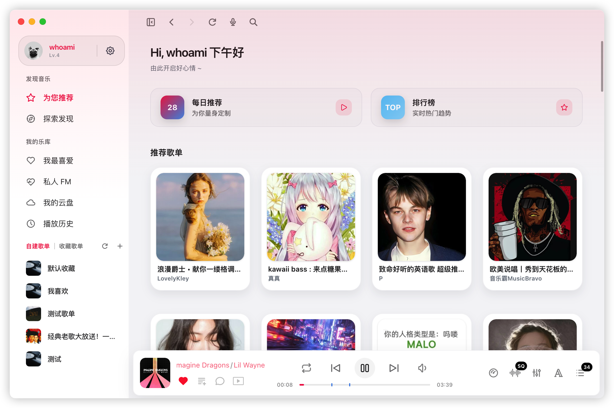
- 发现
  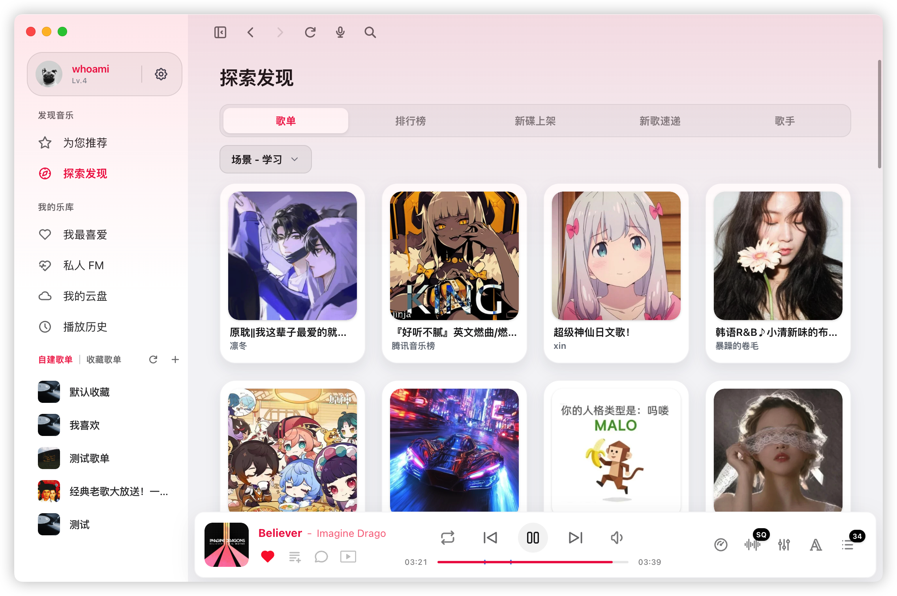
- 私人FM
  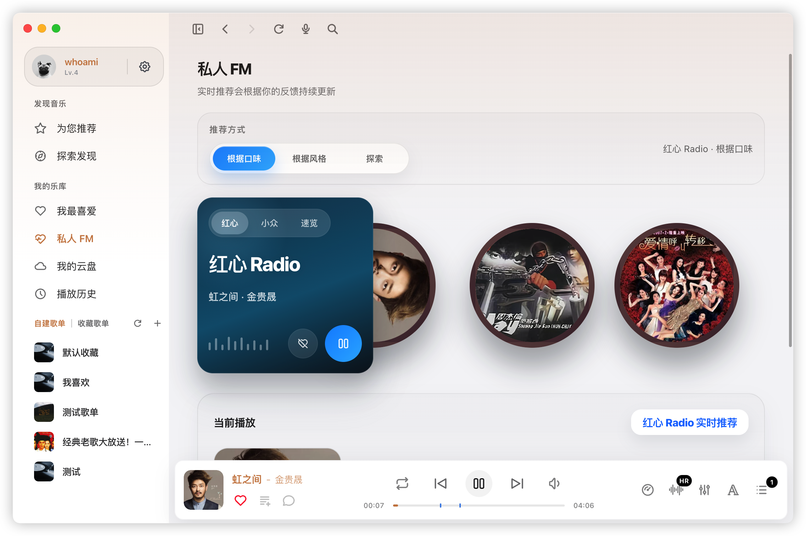
- 听歌识曲
  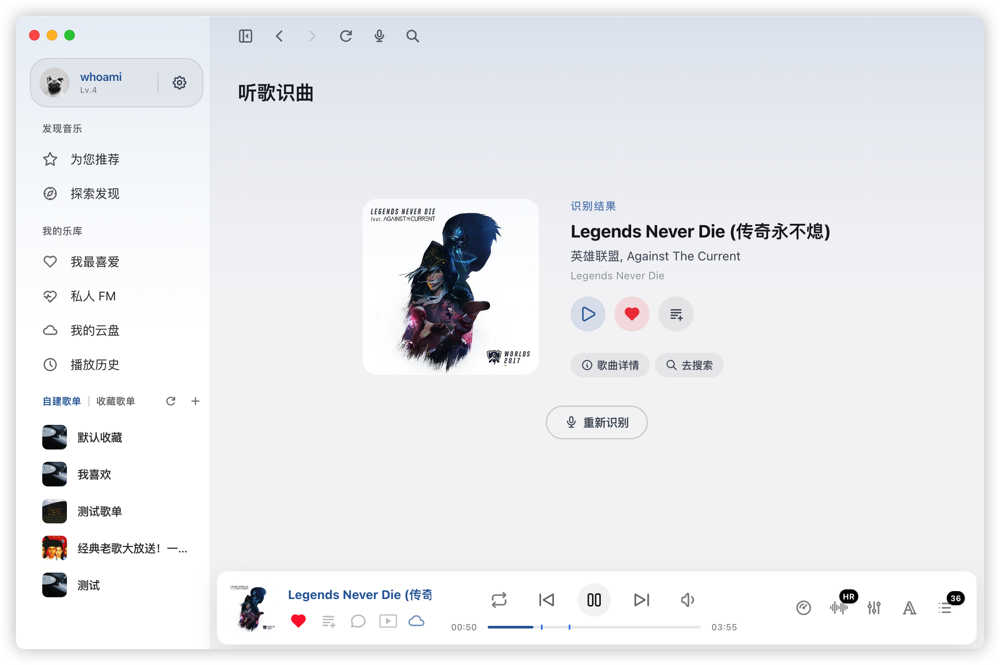
- 歌词
  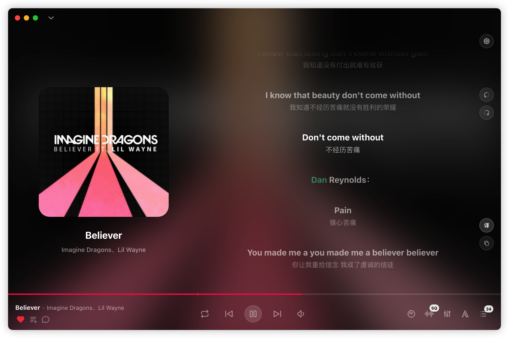
- 歌曲详情
  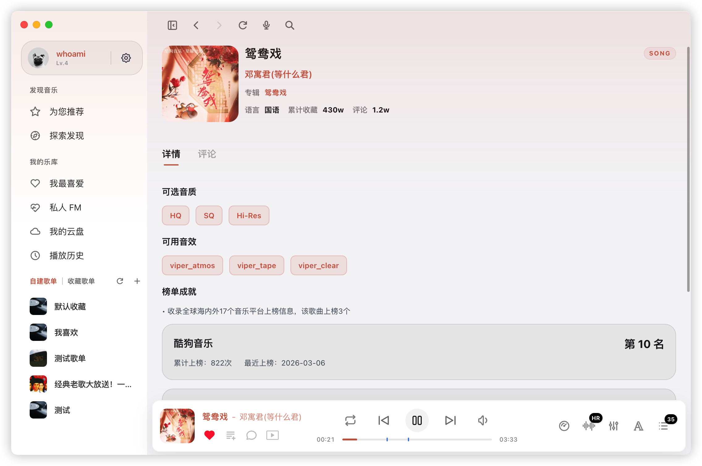
- 歌曲评论
  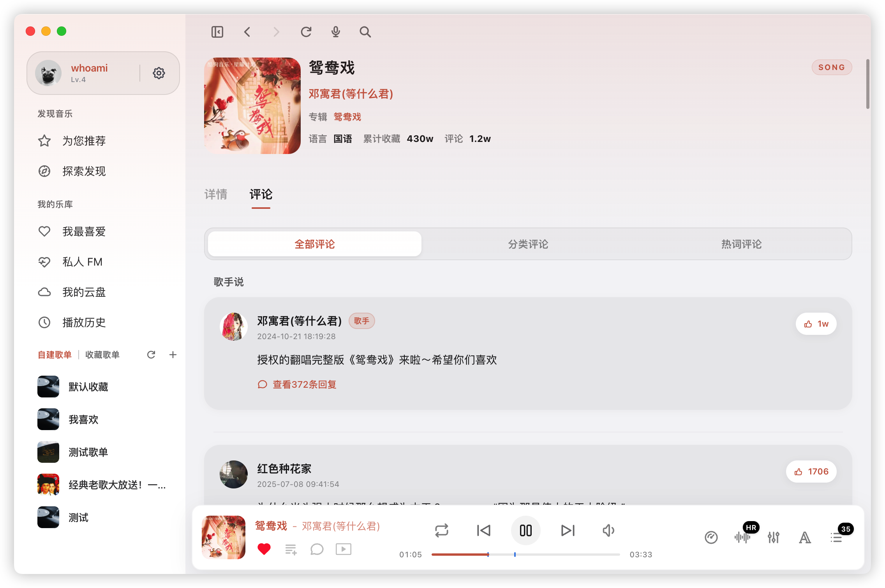
- 播放列表
  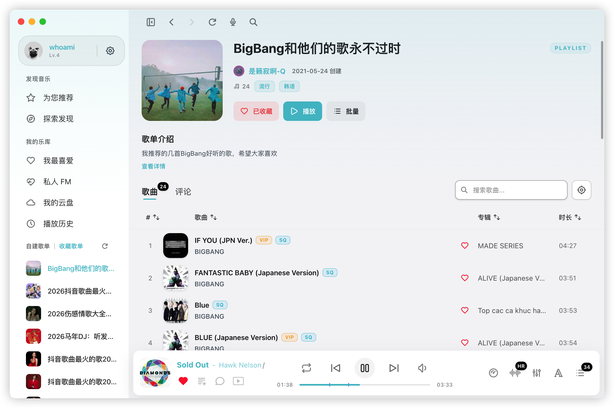
- 专辑
  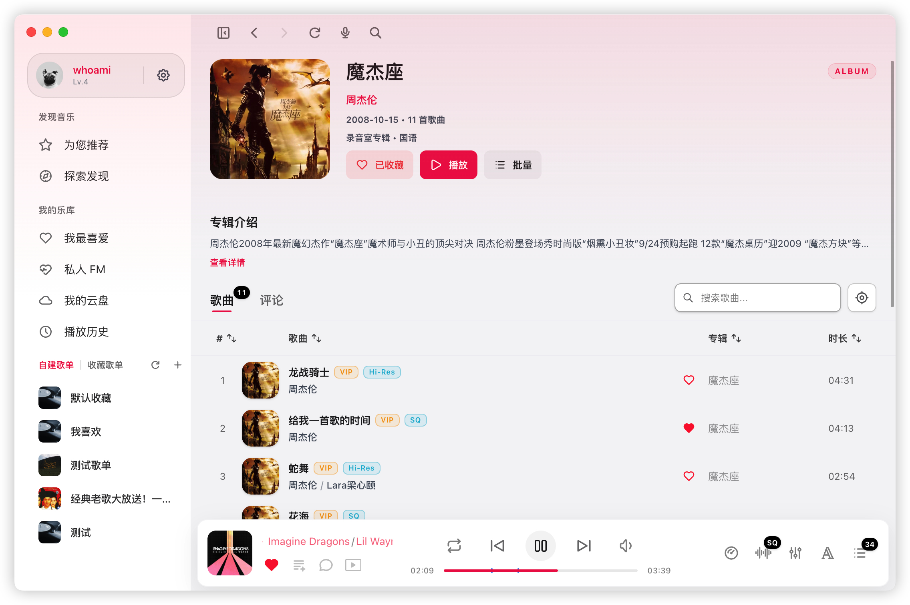
- 歌手
  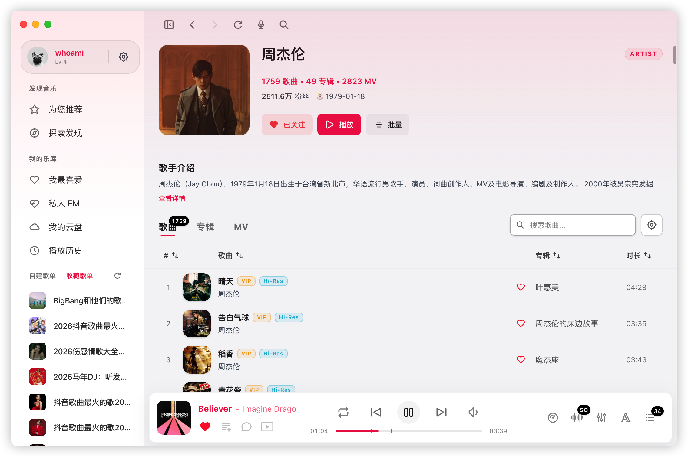
- 搜索
  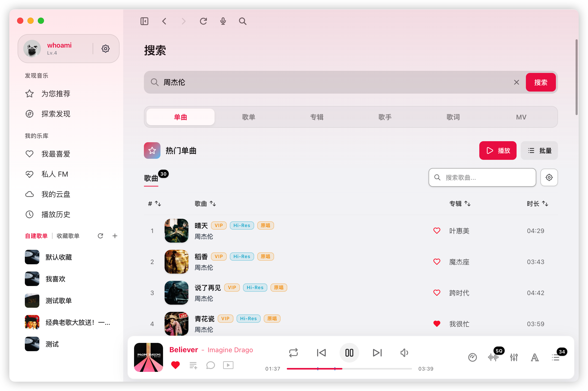
- 个人中心
  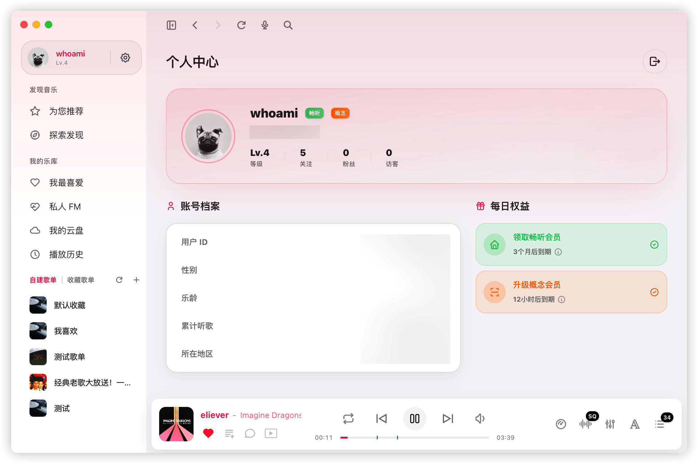
- 设置
  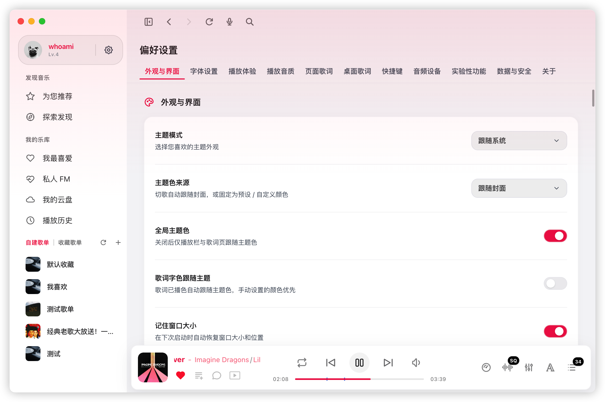

## 🚀 快速开始

### 前置要求

- [Node.js](https://nodejs.org/) 22.12+
- [pnpm](https://pnpm.io/) 9+
- [Rust](https://www.rust-lang.org/) stable（项目中的音频模块声明最低 Rust 1.87，建议使用当前 stable）
- C/C++ 编译工具链及 LLVM/libclang（原生依赖与 `bindgen` 生成绑定需要）

#### macOS

安装 Xcode Command Line Tools 和 LLVM（以下依赖安装命令使用 Homebrew）：

```bash
xcode-select --install
brew install llvm pkg-config
export LIBCLANG_PATH="$(brew --prefix llvm)/lib"
```

已安装 Command Line Tools 时跳过第一条命令。在设置了 `LIBCLANG_PATH` 的同一终端中执行后续构建。

#### Windows

安装 Visual Studio Build Tools 的“使用 C++ 的桌面开发”工作负载及 Windows SDK，使用 MSVC Rust 工具链；编译 ARM64 时还需安装对应的 ARM64 C++ 工具。LLVM/libclang 可通过以下 PowerShell 命令安装、配置：

```powershell
winget install LLVM.LLVM
$env:LIBCLANG_PATH = "C:\Program Files\LLVM\bin"
```

`LIBCLANG_PATH` 必须指向包含 `libclang.dll` 的目录。以上设置立即作用于当前终端；如需持久化，可再执行 `setx LIBCLANG_PATH "C:\Program Files\LLVM\bin"`，新终端才会读取该持久化设置。也可使用 Visual Studio 自带 LLVM 的相应目录。

#### Linux

以 Debian / Ubuntu 为例，安装编译工具、libclang 和音频后端开发库；后半部分为运行 Electron 所需的桌面依赖：

```bash
sudo apt-get update
sudo apt-get install -y build-essential pkg-config clang libclang-dev \
  libasound2-dev libpulse-dev libpipewire-0.3-dev \
  libgtk-3-dev libnotify-dev libnss3 libxss1 libxtst6 xdg-utils
```

其他发行版安装对应软件包。播放引擎的 Linux 后端同时启用 ALSA、PulseAudio 和 PipeWire，不能只安装其中一个后端的开发库。

### 本地开发

1. **克隆仓库**

   ```bash
   git clone https://github.com/hoowhoami/EchoMusic.git
   cd EchoMusic
   git submodule update --init --recursive
   ```

2. **安装依赖**

   ```bash
   pnpm install
   ```

   > `server` 子模块已作为 pnpm workspace 成员管理，上述命令会自动一并安装其运行依赖，无需再单独进入 `server` 目录执行 `npm install`。

   在Linux下，可能会出现如下报错:

   ```bash
   Error: ENOENT: no such file or directory, open '/home/xxx/Projects/Work/EchoMusic/node_modules/electron/path.txt'
   ```

   需手动下载并解压Electron到对应目录：

   ```bash
   cd node_modules/.pnpm/electron@43.4.1/node_modules/electron/
   mkdir -p dist
   curl -L -o /tmp/electron.zip "https://npmmirror.com/mirrors/electron/v43.4.1/electron-v43.4.1-linux-x64.zip"
   unzip -o /tmp/electron.zip -d dist/
   printf '%s' './electron' > path.txt
   ```

3. **编译全部 Native 模块**

   `*.node` 产物不随源码提交。首次开发、修改 Rust 代码或切换系统/CPU 架构后，都需要构建对应模块。根目录的 `pnpm install` 只覆盖根项目和 `server` workspace，`pnpm dev` / `pnpm build` 不会自动编译这些 Native 模块。

   | 模块目录                       | 用途                       | 构建平台                        |
   | ------------------------------ | -------------------------- | ------------------------------- |
   | `native/echo-audio-player`     | 播放、解码及音效处理       | macOS / Windows / Linux         |
   | `native/echo-audio-capture`    | 系统音频和麦克风采集       | macOS / Windows / Linux         |
   | `native/echo-media-controls`   | 系统媒体控制               | macOS / Windows / Linux         |
   | `native/echo-sqlite-store`     | SQLite 持久化存储          | macOS / Windows / Linux         |
   | `native/echo-platform-adaptor` | 系统窗口、任务栏等平台适配 | macOS / Windows；Linux 无需构建 |

   以下命令均从仓库根目录执行，逐个安装模块的构建依赖并运行其 `build` 脚本（`napi build --release --no-const-enum`），遇到错误即停止。

   **macOS / Linux（Bash）：**

   ```bash
   bash <<'BASH'
   set -e
   addons=(echo-audio-player echo-audio-capture echo-media-controls echo-sqlite-store)
   if [[ "$(uname -s)" == "Darwin" ]]; then
     addons+=(echo-platform-adaptor)
   fi
   for addon in "${addons[@]}"; do
     (
       cd "native/$addon"
       npm install
       npm run build
     )
   done
   BASH
   ```

   **Windows（PowerShell）：**

   ```powershell
   $addons = @("echo-audio-player", "echo-audio-capture", "echo-media-controls", "echo-sqlite-store", "echo-platform-adaptor")
   foreach ($addon in $addons) {
     Push-Location "native/$addon"
     try {
       npm install
       if ($LASTEXITCODE -ne 0) { throw "安装 $addon 构建依赖失败" }
       npm run build
       if ($LASTEXITCODE -ne 0) { throw "构建 $addon 失败" }
     } finally {
       Pop-Location
     }
   }
   ```

   每个模块会在自身目录生成同名 `.node`，例如 `native/echo-audio-capture/echo-audio-capture.node`。仅执行 `cargo build --release` 不会将产物转换并放到应用期望的这个路径，应使用上述 napi-rs 脚本。

   **检查产物（在仓库根目录执行，适用于三平台）：**

   ```bash
   node -e 'const fs = require("node:fs"); const addons = ["echo-audio-player", "echo-audio-capture", "echo-media-controls", "echo-sqlite-store"]; if (process.platform === "darwin" || process.platform === "win32") addons.push("echo-platform-adaptor"); for (const name of addons) { const file = "native/" + name + "/" + name + ".node"; if (!fs.existsSync(file)) throw new Error("缺少产物: " + file); console.log(file); } console.log("当前 Node 平台/架构:", process.platform, process.arch);'
   ```

   此检查只确认文件存在。所有 `.node` 的平台和架构还必须与运行的 Electron 或打包目标一致：x64 与 arm64 产物不能混用。通常在目标平台、目标架构的环境中构建；交叉编译时，需先准备目标工具链、SDK 和 `rustup target add <target>`，再在**每个模块目录**运行 `npx napi build --release --no-const-enum --target <target>`，打包时选择相同架构。可参考 [CI 构建矩阵](.github/workflows/build.yml)。

   **常见问题：**
   - `Cannot find module .../echo-*.node`：检查对应模块是否构建成功、产物是否位于上述路径。
   - `Unable to find libclang`：检查 LLVM/libclang 安装与 `LIBCLANG_PATH`；它应指向库所在目录，而不是可执行文件。
   - Linux 报 ALSA / PulseAudio / PipeWire 的 `pkg-config` 错误：补齐上面的开发库，并确认 `pkg-config` 能找到目标架构的库。
   - FFmpeg 提示 `Falling back to attempting to link the system's FFmpeg`：检查 `native/echo-audio-player/vendor/ffmpeg-audio/crates/ffmpeg_audio_sys/vendor/` 中的 `ffmpeg_slim.zip` 和 `configs.zip` 是否完整。默认构建不需要设置 `FFMPEG_MODE=system`；使用系统 FFmpeg 会引入额外的开发库及运行时动态库依赖。
   - 重编译后完全退出并重新启动 EchoMusic，已加载的 Native 模块不会随前端热更新重新加载。

4. **启动本地开发服务器**

   ```bash
   pnpm dev
   ```

> 开发模式下会由 Electron 主进程自动拉起本地服务端。

#### 内存诊断

需要观察 Electron 主进程、Renderer、GPU 等进程的内存变化时，可以开启启动阶段内存诊断日志：

```bash
ECHOMUSIC_MEMORY_DIAGNOSTICS=1 pnpm dev
```

日志会写入 Electron 日志文件，例如 macOS 下为：

```text
~/Library/Logs/EchoMusic/echo-music-YYYY-MM-DD.log
```

## 扩展开发

### 音效引擎扩展

EchoMusic 无需导入外部引擎即可使用内置音效能力。兼容的 DSP Provider 可以在“设置 → 音效管理”中导入、启用和切换，为播放器增加独立预设、参数设置及组合音效支持。播放器根据 Provider 声明的能力生成界面和应用音效，不依赖某个特定引擎的实现。

- [DSP Provider 架构与接入协议](docs/dsp-provider-architecture.md)
- [预设、参数与设置界面协议](docs/dsp-provider-settings.md)

### 插件系统

EchoMusic 支持在线插件源和本地插件，可以扩展页面、音源、歌词、播放器交互、后台任务、独立浮窗与本地服务。插件运行在受信任的本地扩展环境中，并非浏览器扩展沙盒；请只安装来源可信的插件。

- [插件系统说明](docs/plugin-system.md)
- [完整插件开发指南](https://github.com/hoowhoami/EchoMusicPlugins/blob/main/docs/plugin-development.md)
- [官方插件源与示例](https://github.com/hoowhoami/EchoMusicPlugins)

## 🏗️ 编译发布

项目使用 GitHub Actions 进行自动化构建。每当推送 `v*` 格式的 Tag 时，会自动触发多平台构建并将二进制包上传至 Releases。

**手动编译：**

先完成“快速开始”中的依赖安装及全部 Native 模块构建，确认 `.node` 与打包架构一致，再在根目录执行：

```bash
pnpm build
```

`pnpm build` 执行类型检查、Vite 构建和 electron-builder 打包；`npmRebuild` 已关闭，打包过程只复制现有 Native 产物，不会替你补编译。Windows / macOS 需包含全部 5 个模块，Linux 需包含前 4 个。

## 📦 打包产物

- **macOS**：`dmg`、`zip`
- **Windows**：`exe (nsis，x64/arm64)`
- **Linux**：`deb`、`rpm`、`AppImage`、`tar.gz`

## macOS

当前发行版使用 ad-hoc 签名，不支持 Squirrel.Mac 自动安装更新。应用内检查更新后，请下载对应架构的 DMG（Apple Silicon 选择 arm64，Intel 选择 x64），退出 EchoMusic，再将新版本拖入「应用程序」替换旧版本。

```bash
xattr -cr /Applications/EchoMusic.app && codesign --force --deep --sign - /Applications/EchoMusic.app
```

## 交流群

- [Telegram](https://telegram.me/+H9vpkAJrDlViZjU1)
- QQ1群: 1036693403
- QQ2群: 491694809

## 💡 灵感来源

本项目受到以下优秀开源项目的启发：

- [KuGouMusicApi](https://github.com/MakcRe/KuGouMusicApi) - 酷狗音乐 NodeJS 版 API
- [SPlayer](https://github.com/imsyy/SPlayer) - 一个简约的音乐播放器
- [ffmpeg-audio](https://github.com/apoint123/ffmpeg-audio) - 基于 FFmpeg 的 Rust 音频解码库
- [soundtouch-rs](https://github.com/apoint123/soundtouch-rs) - Rust 音频变速处理库
- [MoeKoeMusic](https://github.com/MoeKoeMusic/MoeKoeMusic) - 一款开源简洁高颜值的酷狗第三方客户端

## 📄 免责声明

本项目是基于公开 API 接口开发的第三方音乐客户端，仅供个人学习和技术研究使用。

- **数据来源**：所有音乐数据通过公开接口获取，本项目不存储、不传播任何音频文件
- **版权声明**：音乐内容版权归原平台及版权方所有，请尊重知识产权，支持正版音乐
- **使用限制**：禁止将本项目用于任何商业用途或违法行为
- **责任声明**：因使用本项目产生的任何法律纠纷或损失，均由使用者自行承担
- **争议处理**：如版权方认为本项目侵犯其权益，请通过 Issues 联系，我们将积极配合处理

**本项目不接受任何商业合作、广告或捐赠。**

## ⚖️ 开源协议

基于 [GNU General Public License v3.0](https://www.gnu.org/licenses/gpl-3.0.html) 协议发布，完整协议文本见 [LICENSE](LICENSE)。

第三方依赖与授权说明见 [THIRD_PARTY_NOTICES.md](THIRD_PARTY_NOTICES.md)。
