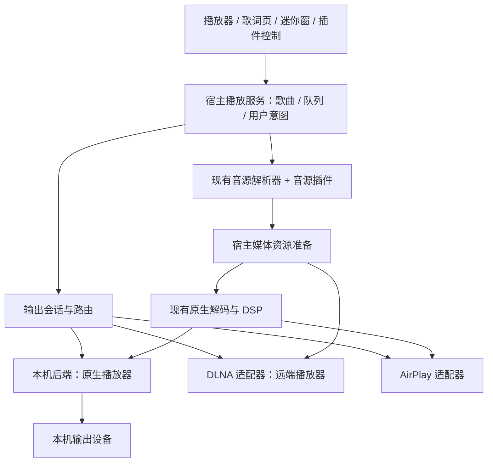

# EchoMusic DLNA / AirPlay 最终设计

日期：2026-09-23。状态：范围确认，用户指定改由 OpenCode 通过 Herdr 开发，原 Claude 任务终止。本文为实现依据；依赖与设备兼容性须通过编译和真机验收。

## 1. 确定范围

采用“宿主统一输出会话 + 内部协议适配器”的结构。现有音源插件 API 与宿主调用流程保持不变；宿主取得音源后，按所选播放设备决定如何播放。插件 API 不新增、不修改。

用户已确认：EchoMusic 只做发送，首期覆盖 macOS、Windows、Linux；DLNA 当前只做原曲投放；插件 API 不新增、不修改。AirPlay 采用跨平台独立发送并复用本机 DSP 后音频。首期实现单目标、断线暂停并保留队列。

本次不实现接收端、NAS 音乐库浏览、多房间同步、视频投屏、DLNA 本机 DSP 后流、DLNA 转码/转封装、新增插件输出或设备 API。原曲不兼容时明确提示，不静默转码。

## 2. 当前仓库的约束

| 代码位置 | 已核实情况 | 设计影响 |
| --- | --- | --- |
| `src/renderer/stores/player.ts` | 直接实例化 PlayerEngine，持有歌词时钟、音源刷新等状态 | 需要抽出输出路由，不能在插件里再维护一份播放器 |
| `src/renderer/stores/player/playback.ts` | 队列推进、私人 FM、预加载/无缝切歌与原生请求序列耦合 | 远端模式按能力关闭不适用路径，保留宿主队列规则 |
| `src/renderer/utils/player.ts`、`src/main/ipc/player.ts` | 通过 IPC 调用本地 PlayerController | 新远端控制应在统一入口路由，不能遗漏媒体键/迷你窗/定时停止 |
| `native/echo-audio-player/src/device/platform_macos.rs` | 枚举 CoreAudio 输出设备 | 可以开展系统 AirPlay 路由验证，尚不能保证发现未连接设备或独立选路 |
| `src/renderer/plugins/audioSource.ts` | 插件解析/转换 URL、候选、多音轨 | 音源与输出 provider 保持正交；现有解析结果不包含完整转发能力描述 |
| `src/main/plugins/webServer.ts` | 仅 127.0.0.1，响应全量 Buffer、8 MiB 限制 | 不能复用为 LAN 媒体服务器，不放宽其绑定规则来绕过新职责 |
| `src/shared/plugins.ts` | 有 TCP、process、Web 服务，无 UDP/discovery/output provider | 宿主实现协议适配；现有插件 API、manifest、权限契约不变 |
| `docs/plugin-system.md`、`runtime/moduleLoader.ts` | 插件是信任代码，运行于 renderer；capability 不是沙箱 | 权限声明是治理与 API 开关，不能宣传为恶意插件隔离 |
| `docs/dsp-provider-architecture.md` | FFmpeg → DSP → tempo → 输出增益 → 设备；原生 DSP 为独立 ABI | 输出扩展不复用 DSP ABI，不让网络操作进入 DSP 实时线程 |

当前查找范围内未发现 DLNA、AirPlay、SSDP、mDNS 的现有实现。原有 `server` 子模块修改保留。

## 3. 用户交互

播放器栏音量附近新增“播放设备”按钮；选中远端后显示简短设备名。点击弹层包含当前输出、本机设备、网络设备、刷新和连接诊断。设备有协议标签与连接状态；相同名称不直接合并，只有可靠稳定身份才能建立多协议关联。

宿主播放器栏提供设备面板；宿主自带歌词页、迷你播放器复用内部播放控制，按现有布局需要提供入口。插件歌词皮肤继续调用现有 player API，本次不要求增加设备入口，也不新增设备面板或设备状态 API。应用设置提供网络播放开关、发现设置与连接记录清除；沿用现有本机音频设备设置。

默认仅在用户开启网络播放、打开设备列表或存在活动会话时进行发现。弹层关闭后降低/停止非必要扫描，活动连接继续维护。区分“没有找到设备”“网络权限未授予（可确认时）”“设备不支持当前格式”“连接失败”，不把所有超时判为权限问题。

切换流程：预检设备和歌曲兼容性 → 保持旧输出播放并准备新目标 → 暂停旧输出 → 启动新会话并校验状态 → 成功提交路由。失败时清理新目标，尽力恢复旧输出；标注网络切换可能有短暂空隙，不承诺原子无缝切换。远端停止超时会显示状态未知，不能假定它已静音。

主动“切回本机”时在可支持的进度恢复；断线默认暂停、保留队列与最近可信位置，并提供重连/切回本机。避免断线后意外外放。每个目标分别记忆音量，进入远端会话先读取设备音量，不把本机高音量直接覆盖音箱。

退出时尽力停止远端并释放资源；直连设备可能继续播放，界面和说明要区分直连与依赖 EchoMusic 中转的会话。首期队列需要 EchoMusic 运行，关闭窗口与退出应用遵循已有应用行为。

## 4. 架构与职责

输出路由只表示拿到音源后，在本机、DLNA、AirPlay 三个播放去向间切换，不是另一套音源解析或插件 API。定义两种内部后端语义：`remote-media`（设备拉取并解码资源）与 `local-pcm`（本机解码、处理后输出）。DLNA 仅使用原曲远端媒体会话；独立 AirPlay 使用本机 PCM 网络输出。

宿主持有当前曲目、队列顺序、播放模式、唯一活动会话和音量策略。适配器持有设备协议状态、连接、能力、实际播放状态。JS 插件不拥有第二份全局队列。

分步接入，先保留 renderer 的既有队列和音源解析；新增主进程 OutputSessionManager 持有路由 epoch、命令序列和资源租约。renderer 的统一播放 facade 经 IPC 操作活动后端。本机适配器继续使用 PlayerController；远端适配器按同一契约报告事件。无需为了本功能先把整个 Pinia 播放器迁入主进程。

网络发现、媒体 HTTP 服务采用异步 I/O，不能阻塞主进程；独立 AirPlay 编码和时序放在受宿主管理的原生 worker/helper。本次 DLNA 不引入转码。普通插件 JS 不承载实时 PCM，宿主控制消息可经内部 IPC，音频走有界原生缓冲/专用数据通道。

### 宿主内部会话契约（不暴露给插件）

- Target：providerId、targetId、displayName、protocol、availability、capabilities；目标身份不使用会变化的 IP。
- Session：sessionId、routeEpoch、trackGeneration、commandId、state、observedPosition、observedAt、clockAccuracy、actualFormat、volume。
- 能力按设备和当前资源共同计算：pause、seek 模式、volume/mute、rate、position、nextUri、gapless、DSP、spectrum。未知视为不可保证，命令被拒后降低能力，不只信协议标识。
- 生命周期：discover → connect/pair → prepare → start → pause/seek → stop → dispose；每步 timeout/cancel，清理幂等。
- 命令串行化；快速切歌/切目标使旧 generation 失效，旧事件不能推动新队列。
- GENA/轮询等远端观测进入同一时钟模型，按单调时钟短时插值并定期校正；数据过期即停止伪装精确进度。
- `STOPPED` 可能来自用户、其他控制器或错误，不能直接当作 EOF；结合当前 URI、时长、位置和 pending command 判定，自然结束只推进一次。
- 外部控制器替换远端 URI 时标记会话被接管，停止本机自动抢播/推进。

## 5. DLNA 路径

首期实现控制点，发现可用 MediaRenderer。SSDP 处理主动搜索、alive/byebye、缓存过期、多网卡和睡眠恢复；使用服务描述解析控制/事件 URL，而非硬编码厂商路径。

通过 ConnectionManager 获取协议/格式能力，AVTransport 操作加载、播放、暂停、停止和按支持情况 seek，RenderingControl 管理音量/静音。接入事件订阅与续租，并用有节制的状态轮询补偿不可靠设备。使用 DIDL-Lite 传递标题、艺人、专辑与封面。服务版本按设备协商，支持旧设备，不只认最新版本。

媒体提供策略：

1. 满足可达性、鉴权、有效期与格式要求时允许设备直拉；不能仅因 URL 是 HTTPS 就判定可用。
2. 本地文件、loopback URL、需要请求头/凭证的源由宿主提供会话范围的 LAN HTTP 中转。默认优先中转私有/短时有效资源；允许按设备能力使用直连。
3. 内容不兼容时明确提示；本次不实现转封装/转码或 DSP 后流。支持格式由协议声明和实际验证共同确定，不承诺所有设备支持 FLAC。原样中转保持媒体数据内容，不改变编码、音效或音质。

宿主内部 MediaResource 包含 opaque resourceId、来源、MIME/codec、时长、长度、可 seek 范围、有效期、转发策略和刷新方法。继续消费现有音源插件结果，不新增返回字段要求；缺失信息由宿主探测或保守处理，刷新继续调用既有流程。凭证保留在宿主，不转交设备。

LAN 服务支持 GET/HEAD、Range、206/416、Content-Length/Content-Range、正确 Content-Type 和背压；按实测需要实现 DLNA 请求头。URL 用不可猜测、可撤销的会话令牌，活动会话内支持重连和重复 Range，避免短 TTL 在长歌中途失效。封面亦使用受控资源 URL。

仅暴露当前歌曲和确有需要的下一首资源，无目录遍历、任意 URL 代理或整库公开。选定出口网卡，局域网连接不走公网 HTTP 代理；访问云音乐上游仍沿用现有应用网络配置。绑定资源、接口和设备会话，结束后撤销。设备描述/XML 限制大小、层级和时间，禁用外部实体；校验设备端点和重定向，防止不可信发现响应探测任意地址。

首期不启用设备端队列或 SetNextAVTransportURI 自动推进；先完成宿主队列闭环。后续可加入下一曲预装载，但必须处理设备抢先切歌和只计一次播放历史。

### 对现有功能的影响

| 功能 | DLNA 原文件直拉/中转 | 本机 PCM / 独立 AirPlay |
| --- | --- | --- |
| 本机 EQ、DSP Provider、空间音效 | 不经过，展示本次未应用 | 仍经原生音频图，输出兼容性待实机验证 |
| 音源自带的已处理音效 | 若该音源格式可播放则保留 | 按现有解析规则 |
| 本机响度归一化 | 不保证，不悄悄改设备音量模拟 | 沿用原生链路 |
| 歌词 | 按远端进度校正；精度不足需降级 | 需补偿网络输出延迟并验证 |
| 频谱 | 无可用 PCM 时显示不可用 | 按当前频谱采样点能力，不能宣称等同音箱最终输出 |
| 倍速、seek、静音 | 当前会话支持才开放 | 按本机链路和路由能力 |
| 无缝、crossfade | 首期关闭 | 有网络缓冲，需实测后承诺 |
| 私人 FM / 普通队列 | 沿用宿主选曲并延迟解析下一曲 | 沿用现有行为 |
| 一起听 | 首期禁用网络投放并解释同步延迟，后续专门适配 | 系统默认路由也可能远端；不能假称已拦截所有系统 AirPlay |

将“用户音效偏好”与“当前输出实际生效状态”分开，切回本机恢复原设置，不因投放清空偏好。

## 6. AirPlay 首期跨平台独立发送

用户已确认首期覆盖 macOS、Windows、Linux。EchoMusic 自行发现、配对、选设备和维护发送会话。macOS 系统输出只能作为辅助路径，不能替代三平台交付。

建议复用本机解码及 DSP，增加受宿主管理的原生网络输出，完成格式协商、编码/封包、缓冲和时钟同步。音频不经过 renderer JS，不捕获整个系统声音。发送进度和音箱实际播放进度分别记录，歌词按可测输出延迟校正。远端音量与本机最终增益明确唯一控制策略，避免重复衰减。

优先验证 Rust airplay2-rs 固定版本，参考 AirSend 的 Windows 修补；DLNA 优先采用 rupnp 3.0.0 作为薄 UPnP 底层。详情见 [调研报告](dlna-airplay-research.md)。依赖版本在验证后锁定，必要补丁纳入可复现构建，不依赖临时目录或手工改库。

airplay2-rs 当前高层 seek 仅发位置事件，必须补齐真实源跳转、远端缓冲清理与时间戳协调，不能假成功。持续 PCM 输入目前为 i16，实际位深/采样率须显式记录，不能宣称保留 24-bit 源。满队列不能照搬 try_send 丢帧策略，须在非实时线程提供有界背压与取消。上游未隔离的 Unix API 和 Windows 时序设置需要适配。三平台构建、配对、长时间传输、CPU、分发体积均须验证。

发现 AirPlay 设备不等于已支持其发送模式。AirPlay 1/2、密码/PIN、具体设备/固件覆盖要作为 P0 输出，首期三平台是明确目标，但全设备兼容尚无实测依据。

用户已通过系统选择的 macOS 输出沿用既有本机播放行为。本次无需额外开发系统 AirPlay 专用路由；不能用空 AVPlayer 加 route picker 假装接管 Rust PCM，也不能以系统路由替代独立发送。

## 7. 插件边界：API 不新增、不修改

音源仍由现有音源插件 API 提供，宿主按现有解析、候选选择与刷新流程使用。插件无需知道最终输出设备。宿主在取得结果后选择本机播放、DLNA 原曲直拉/原样中转，或 AirPlay 本机解码与音效处理后发送。

| 能力 | 本次处理 |
| --- | --- |
| 音源插件 | API、参数、返回结构和调用流程保持不变；不要求插件升级 |
| 插件 player API | 方法、事件、既有状态字段契约保持不变；宿主将其操作适配到当前输出 |
| 插件歌词皮肤 | 使用现有控制与播放状态；不要求设备按钮，不新增目标状态 API |
| 插件 manifest / 权限 / SDK | 不新增 output、UDP、发现或 PCM 能力；不修改声明契约 |
| 插件 WebServer / TCP / process | 保持既有接口、限制与授权语义；LAN 中转由宿主单独实现 |
| 原生 DSP Provider | 沿用现有 ABI 和音效链；不承担设备发现或网络发送 |
| 宿主内部实现 | 可新增设备发现、媒体服务、会话管理、内部类型及主进程/原生模块通信，不作为插件 API 发布 |

“API 不变”指公开接口和既有契约不变，不禁止修改宿主内部实现，以便现有 play/pause/seek 等操作正确作用于当前输出。能力不支持时使用既有错误/状态机制处理，不伪造成功，不要求插件新增参数或输出分支。

共享内部文件如包含插件公开类型，不得顺带扩展或改变其契约。设备路由状态放在宿主内部模块，不作为插件必须消费的公共结构。若真实需求必须改变公开契约，先报告冲突，不能自行扩展范围。

## 8. 实施与验收计划

| 阶段 | 可评审交付 | 进入下一阶段的条件 |
| --- | --- | --- |
| P0 技术验证 | 锁定候选与补丁、完成可用平台构建和最小传输探针、建立真机矩阵 | 验证基础会话；缺少平台/设备时记录阻塞并继续独立实现，最终验收保留未通过项 |
| P1 公共会话层 | 本机适配器、路由状态、能力模型、设备入口、旧 API 兼容 | 原有本地播放、源切换竞争、媒体键、迷你窗、FM 和歌词回归通过 |
| P2 DLNA MVP | 发现、控制、受控中转、状态校正与断连 UX | 至少两类真实设备及错误路径通过；长音频不整首载入内存 |
| P3 AirPlay | 交付三平台应用内独立发送 | 单目标长时间播放、配对（如适用）、时钟和睡眠恢复验证 |
| P4 兼容与交付验收 | 验证既有音源、插件控制、皮肤和本机播放回归；三平台构建与打包 | 插件 API 零变更，已有插件无需升级；列出真机通过与未验证项 |

建议新增模块：`src/shared/playbackOutput.ts`、`src/main/outputs/`、`src/main/mediaTransport/`；renderer 增加统一 facade/设备面板，按实际结构命名。独立 AirPlay 原生 transport 模块在 P0 验证后确定接口。

自动化覆盖：发现过期与多网卡变化、命令取消/乱序、旧事件、停止与 EOF 区分、一次性队列推进、外部控制接管、URL 更新、Range 边界/背压、插件卸载资源释放。验证原有播放相关回归，不用 mock 测试代替真机协议兼容。

真机矩阵：Windows/macOS/Linux；DLNA 音箱及电视/接收器；三平台独立发送 + 目标 AirPlay 音箱/Apple TV（按用户设备收敛）；本地 MP3/FLAC、在线短效 URL、需要凭证的源、插件 loopback 源、多音轨不兼容源；Wi-Fi/有线双网卡、权限拒绝、防火墙阻断、睡眠/断网/设备消失、快速切歌、长时间播放。

macOS 本地网络权限须按实际发布版本配置描述与签名，并在打包应用验证；Windows 防火墙与 Linux 网络环境亦纳入安装包验收。当前 package.json 未见局域网用途描述，不能只测开发进程。

日志记录 session/command、目标协议、实际格式、状态时序和清理结果，去除凭证及媒体令牌。验收报告标明自动测试、桌面 UX 检查、真机型号与未验证范围。

## 9. 决策与交付规则

已确定：只发送；三平台；DLNA 只投放原曲；AirPlay 复用现有 DSP 后 PCM；插件 API 不新增、不修改，音源仍由宿主按既有插件流程使用。实现采用单目标和断线暂停默认行为。

用户已授权通过 Herdr 安排 OpenCode 开发，替换原 Claude 任务。按 P0–P4 连续推进，不将技术验证误当成仅交付演示，不扩大排除项。具体设备型号和测试平台作为验收资料继续收集，不阻塞独立模块开发，也不能用缺少设备代替真机验收结论。

交付包含实现、针对会话/媒体边界的有效测试、必要文档、依赖锁定与可复现构建说明。保留已有 server 子模块和其他无关改动；未经额外指令不提交、不推送、不发布。依赖关键能力不可实现时报告具体证据与影响，不用占位代码或假事件宣布完成。

### DSP 与传输的解释

- 本机播放：压缩歌曲 → 解码成采样数据 → DSP → 本机扬声器。
- DLNA 原曲：原文件/原样中转 → 音箱解码 → 音箱播放；EchoMusic 控制播放和提供资源，但样本没有经过本机 DSP。
- 不在本次范围的 DLNA 带本机音效：歌曲 → 本机解码 → DSP → 封装/编码为设备支持的流 → 音箱缓冲、解码、播放。协议并不禁止这条路径。
- 重新编码不一定是有损压缩：可协商设备支持的 PCM 或无损格式，不能假定所有接收器都支持这些实时流。
- 网络缓冲在原曲模式也存在。DSP 模式额外涉及持续流生产、seek 时重建源时间与输出时间映射、远端旧缓冲失效、音效变更何时可听见、流格式与长度/Range 兼容。延迟不能笼统归因于 DSP 运算本身，更不能在未测量前报固定数值。
- 用户感知主要是开始/切歌/拖动以及音效调整到真正听见的等待；稳定播放时并非歌曲持续变慢。

## 10. 依据与未验证项

以下是协议依据，架构和分期为根据当前代码作出的设计判断：

- [OCF UPnP AV 标准入口](https://openconnectivity.org/developer/specifications/upnp-resources/upnp/mediaserver4-and-mediarenderer3/)：服务职责和版本。
- [OCF UPnP Device Architecture](https://openconnectivity.org/upnp-specs/UPnP-arch-DeviceArchitecture-v2.0-20200417.pdf)：发现与事件订阅。
- [Apple AirPlay 集成](https://developer.apple.com/documentation/avfoundation/supporting-airplay-in-your-app)与 [AVRoutePickerView.player](https://developer.apple.com/documentation/avkit/avroutepickerview/player)：公开 AVFoundation/AVKit 路径与 AVPlayer 关联。
- [Apple Mac AirPlay 使用说明](https://support.apple.com/en-us/105068)：系统控制中心输出与单目标限制。
- [Apple TN3179](https://developer.apple.com/documentation/technotes/tn3179-understanding-local-network-privacy)：macOS 15 起本地网络隐私及平台差异。
- [OwnTone](https://github.com/owntone/owntone-server)及[其 AirPlay 文档](https://owntone.github.io/owntone-server/audio-outputs/airplay/)：发送端与配对实践。
- [pyatv](https://github.com/postlund/pyatv)：另一发送/控制实现候选。

设计阶段只完成静态源码和文档核查，没有运行播放器或连接音箱；设备能力、歌词延迟与跨平台打包尚未实测。开发与验收必须更新实际结果，不能把设计目标当作已实现或已验证能力。
