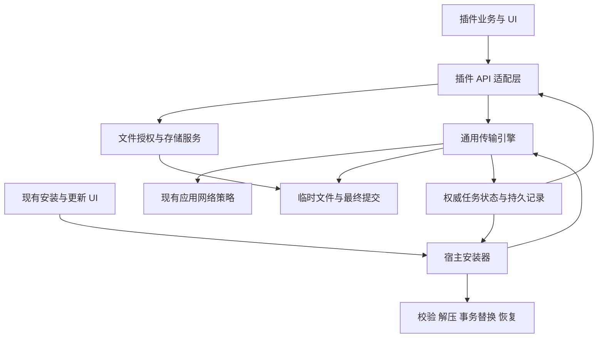
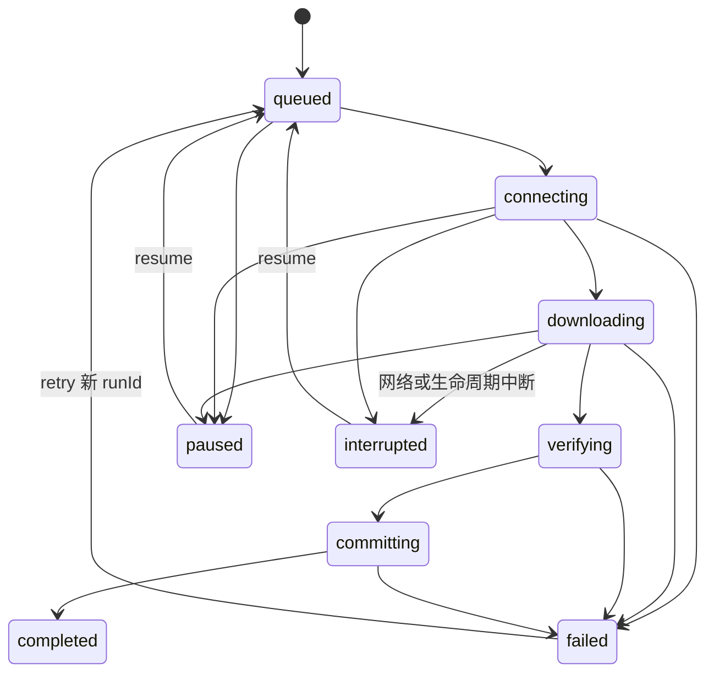

# 插件文件授权与下载服务设计

状态：通用资源 API、流式安装与事务恢复已实施；主题业务由插件负责。日期：2026-10-09。

EchoMusic 提供目录授权、文件存储与完整下载服务，插件通过 API 使用这些能力并负责自己的下载业务界面。插件安装复用同一传输引擎，继续使用宿主安装界面。动态主题的高清媒体独立分发，按需下载或使用用户本地素材。

本文保留系统设计目标。当前已实施的 API、结果结构与限制以 EchoMusicPlugins 的 [文件授权与下载 API](https://github.com/hoowhoami/EchoMusicPlugins/blob/main/docs/files-and-downloads.md) 为准。本次完成通用目录/文件引用、下载/复制任务、受控媒体、授权管理、安装流式传输/解压与事务恢复。安装 UI 的细分阶段/进度/取消、官方独立 ZIP 发布尚未实施；第 10 节是主题插件的接入建议，不是宿主业务实施范围。

## 1. 已确定的范围与职责

| 层             | 负责                                                             | 界面边界                                 |
| -------------- | ---------------------------------------------------------------- | ---------------------------------------- |
| 传输引擎       | 网络流、磁盘写入、背压、大小与哈希校验、续传、取消、任务持久化   | 无 UI，不依赖 renderer                   |
| 插件文件服务   | 私有目录、用户目录/文件授权、路径解析、媒体 URL、授权撤销        | 宿主承担系统选择器与授权管理             |
| 插件下载适配层 | 插件能力检查、任务归属、API、状态订阅                            | 不自动弹进度窗、toast 或创建任务中心条目 |
| 插件业务       | 取得下载地址、选择内容与质量、任务列表、按钮、错误文案、资源清单 | 插件自行提供 UI，可选择接入已有任务中心  |
| 宿主安装器     | 下载程序包、校验、解压、兼容性检查、事务替换与回滚               | 保留现有插件安装/更新 UI                 |
| 动态主题插件   | 主题目录、质量变体、本地素材选择、下载入口与渲染                 | 通用宿主不增加专用主题下载页面           |

主程序只提供必要的系统目录选择和授权管理界面。底层下载任务不因有可读名称或进度而自动出现在任务中心；插件显式通过已有 `ctx.tasks` 展示，宿主安装器使用自己的安装任务桥接。

本次实施范围包括文件引用 API、下载服务、流式安装下载及安装事务恢复、通用接入示例和文档。4K 外置资源目录、质量选择、本地素材界面和离线主题管理由主题插件实施，不在本次宿主改动范围。上传、任意远端代码执行、自动安装第三方程序、下载后媒体转码、跨插件资源去重、系统关机后继续下载不在首期范围。

## 2. 实施前基线及需要解决的问题

| 当前实现                                 | 现有限制                                                                        | 目标                                            |
| ---------------------------------------- | ------------------------------------------------------------------------------- | ----------------------------------------------- |
| `ctx.fs.writeFile()`                     | 单次最多 8 MiB，仅写插件安装目录，整个内容跨 IPC                                | 保留小文件预算；大文件走流式下载/复制           |
| `readTextFile/readFileBytes`             | 片段读取默认 1 MiB，最多 4 MiB                                                  | 保留片段读取，文件引用与授权校验扩展            |
| `ctx.net.request()`                      | 默认缓冲响应最多 32 MiB，可设置 0；返回完整 JSON/text/ArrayBuffer               | 保持兼容，新增独立下载 API                      |
| 插件 ZIP                                 | 下载文件与解压总量各最多 80 MiB                                                 | 保留程序包预算，传输中及时限制                  |
| `ctx.dialog.selectDirectory/selectFiles` | 返回裸路径，不登记按插件保存的授权                                              | 新增持久授权引用接口                            |
| 外部路径读 API                           | 多数只有 `localFiles` 声明检查；部分旧方法不带 pluginId                         | 新引用接口统一检查；旧接口明确兼容边界          |
| 市场下载                                 | 完整 `arrayBuffer()` 后转 Buffer、检查大小和写盘                                | 流式临时 ZIP、逐块统计和校验                    |
| 下载超时                                 | `fetchWithTimeout` 在响应头返回后清 timer                                       | 超时与取消覆盖整个传输                          |
| 默认市场地址                             | 未指定 `downloadUrl` 时下载完整仓库 archive                                     | 官方源逐插件独立发布 ZIP，保留旧源兼容          |
| 安装替换                                 | 暂存后删除旧目录再复制；复制失败不能保证旧版本仍可运行                          | 同卷暂存、旧目录回滚和启动恢复                  |
| 插件 metadata                            | `beginMutation` 撤销访问；`withPluginMetadataMutation` 已等待资源清理再修改文件 | 下载/媒体服务加入现有清理机制，继续等待清理完成 |

当前代码依据：`src/main/plugins/fs.ts`、`network.ts`、`installer.ts`、`index.ts`、`metadata.ts`、`src/main/ipc/plugins.ts`、`src/renderer/plugins/runtime/context.ts` 和 `hostApis.ts`。当前插件信任模型见 [插件系统](plugin-system.md)。

## 3. 服务结构



传输引擎建议放在 `src/main/downloads/`，供宿主和插件适配层调用，避免安装器依赖插件运行时。内部所有者由主进程确定：`host:plugin-installer` 或插件安装身份。插件不能通过参数申请宿主任务归属，也不能用下载 API 提交安装事务。

复用 `src/main/networkPolicy.ts` 管理的 Chromium session 与代理规则；禁止为了流式下载另建绕过用户代理的 Node 网络路径。网络传输、目标解析、时钟与持久存储可注入，方便无 Electron 测试。重活采用异步流式 I/O；校验和解压不能整包占用主进程同步执行。

## 4. 存储与授权

### 4.1 目录职责

```text
userData/
  plugins/<plugin-id>/                  程序包，更新可替换
  plugin-data/<plugin-id>/              持久数据与用户安装的媒体资源
  plugin-cache/<plugin-id>/             可重新生成/获取的缓存
  plugin-transfers/                     任务与恢复元信息
  plugin-file-grants/                   授权记录
  plugins/.install-transactions/<id>/   同卷安装暂存、回滚与事务记录
```

实际位置由宿主生成，不由插件传入绝对路径。新私有目录的引用同时绑定安装身份；同 ID 不同来源不能直接继承原来源的有效授权或任务。既有私有数据默认留存，来源变更时由宿主明确处理是否迁移，不默默暴露给新来源。

安装身份包含 pluginId、规范化程序来源与宿主生成的安装标识。市场程序来源记录实际程序仓库/发布来源，不能只用可包含多个程序仓库的市场 sourceId；下载镜像或 CDN URL 变化不算程序来源变化。普通同源更新沿用标识，卸载后重新安装视为新安装；本地导入替换来源不明时由用户明确决定是否继承旧身份与数据。

用户选择的目录可以位于任意可访问磁盘。主题默认下载到 `plugin-data`，插件可让用户改为授权目录；下载歌曲通常保存到用户授权目录。程序包不保存运行期下载资源。

| 对象             | 更新                 | 禁用/安全模式 | 卸载                                   | 备份                              |
| ---------------- | -------------------- | ------------- | -------------------------------------- | --------------------------------- |
| 程序包           | 事务替换             | 保留          | 删除                                   | 沿用现有程序备份策略              |
| 私有 data        | 保留                 | 保留          | 宿主卸载入口允许选择保留；明确显示占用 | 默认仅配置/清单，大媒体需显式纳入 |
| 私有 cache       | 保留或按缓存策略清理 | 不必删除      | 删除                                   | 默认排除                          |
| 目录授权         | 同身份保留           | 暂时不可用    | 撤销                                   | 路径只作提示，恢复后重新授权      |
| 用户目录正式文件 | 保留                 | 保留          | 保留                                   | 不被宿主自动打包                  |
| 任务临时文件     | 中断后可恢复         | 中断后可恢复  | 只清理可证明属于该任务的临时文件       | 默认排除                          |

备份恢复不使另一台机器上的目录引用自动有效。存储位置变更不自动移动已有媒体；插件通过明确迁移操作调用宿主复制服务，复制完成并验证后再切换引用。

### 4.2 类型

```ts
type FileAccess = 'read' | 'read-write';

interface DirectoryRef {
  id: string;
  name: string;
  access: FileAccess;
  kind: 'user' | 'data' | 'cache';
  available: boolean;
  displayPath?: string; // 只用于展示，不是权限依据
}

type FileRef =
  | { kind: 'directory-file'; directoryId: string; relativePath: string }
  | { kind: 'selected-file'; fileId: string };

type DownloadTarget = {
  directoryId: string;
  relativePath: string;
};
```

单文件授权不隐含父目录访问权。文件引用和目录 ID 是稳定引用；授权 revision、插件运行 generation 与媒体租约属于宿主内部状态，不交给插件伪造。

首次授权仅使用系统文件/目录选择器，选择成功后登记引用，不增加确认弹窗。插件管理页面顶部提供统一入口“已授权文件与目录”，按所属插件分组列出用户选择的内容并提供逐项撤销。已撤销条目只提供“移除记录”，并提示“重新使用请在对应插件中选择文件或目录”。重新选择与重新授权由插件自己的业务入口发起，宿主保留对应插件 API 和系统选择器，不在管理弹窗提供恢复按钮。移除记录清除授权存储中的记录及路径信息，不删除实际文件或目录；未撤销的授权须先撤销，旧引用移除后失效。各插件卡片不单独提供授权管理入口。私有 data/cache 目录由主程序自动创建和管理，不显示在该列表中，也不允许通过该入口移除。

### 4.3 文件 API

| 拟议 API                                                          | 契约                                                                                          |
| ----------------------------------------------------------------- | --------------------------------------------------------------------------------------------- |
| `ctx.fs.requestDirectory({ access, purpose, persist? })`          | 宿主确认插件、用途和模式，再通过系统选择器创建授权；`persist` 默认 true                       |
| `ctx.fs.requestFiles({ purpose, filters?, multiple?, persist? })` | 只创建被选中文件的只读授权；首期不通过它授予任意文件写权限                                    |
| `ctx.fs.listDirectoryGrants()`                                    | 只返回本安装身份的授权，包括不可用/需要重新授权的记录                                         |
| `ctx.fs.reauthorizeDirectoryGrant(id, { purpose })`               | 重新打开系统选择器；同一目录保留 ID 并提升 revision，选择不同目录返回新授权，不偷换旧任务目标 |
| `ctx.fs.revokeDirectoryGrant(id)`                                 | 撤销授权，停止相关操作和媒体租约；不删除正式文件                                              |
| `ctx.fs.revokeFileGrant(id)`                                      | 撤销单文件授权，效果同上                                                                      |
| `ctx.fs.getPrivateDirectory({ kind })`                            | 返回自己的 data/cache 目录；无需系统选择器                                                    |
| `ctx.fs.stat(ref)`                                                | 返回文件状态与尺寸，无文件内容                                                                |
| `ctx.fs.listFiles(directoryRef, options?)`                        | 可递归且有限额，结果提供 FileRef；保留既有枚举选项                                            |
| `ctx.fs.readTextFile/readFileBytes(ref, options?)`                | 保留小片段预算与 offset/length 语义                                                           |
| `ctx.fs.writeFile(ref, data, options?)`                           | 最多 8 MiB，必须有写权限；新引用重载使用临时文件提交，旧字符串重载行为不变                    |
| `ctx.fs.mkdir/deleteFile(ref)`                                    | 只能操作授权范围，删除正式文件必须是插件显式操作                                              |
| `ctx.fs.copyFile(source, target, options?)`                       | 宿主流式复制，返回可观察/取消的文件操作句柄，文件不跨 IPC                                     |
| `ctx.fs.openMedia(ref)`                                           | 返回受控本地 URL 与可释放的媒体租约                                                           |

`requestDirectory/requestFiles` 使用当前 fs 风格结果：成功 `{ ok: true, canceled: false, directory/files }`，取消 `{ ok: true, canceled: true }`，失败 `{ ok: false, error }`。新增文件 API 的错误含稳定 `code` 与可显示 `message`，兼容旧的字符串错误形式时由 runtime 转换。

目录枚举扩展 `PluginFileKind` 增加 `video`，依据扩展名分类但不以分类保证可解码；大文件 `readAudioMetadata(ref)` 同样在主进程执行。`moveFile` 可在后续按真实需求提供，首期不要求跨卷事务移动。

`persist: false` 的用户授权仅在当前主进程会话内有效，页面关闭不撤销，应用重启后失效；私有目录不受此参数影响。复制句柄提供 id/getSnapshot/subscribe/cancel/wait，复用相同提交/冲突和事件规则；首期取消删除复制 partial，重试重新复制，不提供跨重启的复制续传。

### 4.4 检查与撤销

所有新引用操作检查：安装身份、已启用状态/安全模式、`localFiles` 能力、授权所属、读写模式和授权当前 revision。请求目录时不能让插件在标题里伪装宿主身份；宿主提供固定的插件名与访问模式，插件只提供用途。

相对路径拒绝空字符、绝对路径、盘符/UNC 前缀、`..` 越界与 Windows 设备/备用数据流写法。检查根 realpath、已有父目录和符号链接/junction；新写入默认不跟随范围内指向范围外的链接。首期对下载目标拒绝可写路径中的链接组件，避免后续追加/提交绕过范围。外部程序仍可能修改目录，错误要正常返回；这不是对恶意本地进程的隔离保证。

写入最终提交和授权撤销按同一授权锁串行，并在临界区复核插件 generation：撤销先完成，则不得提交；提交先完成，则正式文件保留，撤销阻止后续访问。不能在 revoke 返回后再由迟到任务提交。插件禁用/更新清理同样等待已进入提交临界区的任务结束，再完成撤销返回。目录移动、拔盘或不可写返回可恢复状态，不能悄悄改存其他目录。

同身份同模式更新复用授权；来源变化、read 扩为 read-write 必须重新授权。用户可主动重新选择来替换失效目录引用；进行中的旧任务先中断，再显式迁移/重下。

能力声明仍是宿主 API 开关。现有插件共享受信任 renderer 的模型不变，不能声称新授权会封住所有 legacy API 或直接浏览器能力。

## 5. 下载 API 契约

### 5.1 能力与源

```json
{
  "capabilities": { "localFiles": true, "downloads": true },
  "requires": { "echoMusicVersion": ">=待发布版本" }
}
```

发布前填入真正的最低宿主版本。`downloads` 允许普通 HTTP/HTTPS GET 文件传输，`localFiles` 允许目标引用操作；两者都不能代替有效授权。无需额外声明 `unrestrictedNetwork`，它继续服务现有高级 `net.request`。首期下载不提供上传、自定义 TLS、禁用证书校验或请求体。

插件自行取得源 URL/请求头。宿主不自动注入当前音乐账号 token 或登录 Cookie；插件的业务请求通过原有 API 获取凭据。下载使用应用管理的、与音乐登录凭据隔离的传输 session。普通请求头支持 Referer/Authorization 等下载需求；Cookie、Host 等特殊头必须沿用并验证现有 Chromium 传输策略，不能在文档里承诺全部头均可覆盖。

### 5.2 方法与类型

```ts
interface DownloadSource {
  url: string;
  headers?: Record<string, string>;
}

interface DownloadOptions extends DownloadSource {
  target: DownloadTarget;
  name?: string;
  sourceKey?: string; // 无凭据的业务资源 ID，供重启后插件定位源
  idempotencyKey?: string;
  conflict?: 'fail' | 'rename' | 'replace'; // 默认 fail
  resume?: boolean; // 默认 true，不承诺上游一定支持
  expectedBytes?: number;
  maxBytes?: number;
  checksum?: { algorithm: 'sha256'; value: string };
  connectTimeoutMs?: number; // 默认 30 秒
  idleTimeoutMs?: number; // 默认 60 秒
}

interface DownloadResult {
  taskId: string;
  file: FileRef;
  bytes: number;
  sha256?: string;
}

interface DownloadHandle {
  readonly id: string;
  getSnapshot(): Promise<DownloadSnapshot>;
  subscribe(listener: (state: DownloadSnapshot) => void): () => void;
  pause(): Promise<DownloadSnapshot>;
  resume(source?: DownloadSource): Promise<DownloadSnapshot>;
  retry(source?: DownloadSource): Promise<DownloadSnapshot>;
  cancel(): Promise<DownloadSnapshot>;
  wait(options?: { signal?: AbortSignal }): Promise<DownloadResult>;
}
```

`ctx.net.download(options): Promise<DownloadHandle>` 创建并排队。`ctx.net.downloads.list/get/attach/remove` 查询、重新附着和移除记录，只对本安装身份的任务开放；列表分页，默认只取最近 50 项。`remove` 仅删除终态记录，先处理可证明属于任务的残留 partial；不删除最终文件。无法清理的临时文件进入独立清理记录，不因任务被移除而失去归属。删除用户文件仍须显式调用文件 API。

runtime 提供 JS 句柄，IPC 传可序列化类型与命令，不传函数、Stream、Promise 或 AbortSignal。下载方法沿用 `ctx.net.request` 的 reject 风格，主进程错误映射为 `PluginDownloadError`；取消等待用 `AbortError`。

`subscribe` 在 runtime 立即交付最近快照，再顺序传递更新；解绑与上下文销毁只解除订阅，不取消下载。`wait` 绑定调用时的 `runId`：暂停保持等待；完成 resolve；失败、中断、取消 reject。`wait` 的 signal 只中止等待，真正停止任务要调用 `cancel()`，避免页面销毁误取消后台传输。

runtime 销毁时拒绝其本地 wait 并释放订阅，任务继续由主进程管理。订阅回调不允许异常破坏传输，插件回调异常沿用当前 runtime 的错误上报。

`resume` 恢复暂停/中断的同一 run；`retry` 从 failed 建立新 runId。故障前已经等待的 Promise 不因 retry 再次变成 pending。错误之后调用新的 wait，观察新 run。需要更新 URL/headers 时传入新 source；该 source 必须对应原资源，不能借 retry 替换任务目标或预期哈希。

相同 `idempotencyKey` 在本身份内复用同一任务，参数不匹配返回冲突；失败重试仍需显式 retry。completed 记录复用前检查最终文件仍存在且身份/尺寸符合记录，发现已删除返回 `FILE_MISSING`，不伪装再次完成。没有 key 则每次创建独立任务。

### 5.3 完整调用示例

```js
const picked = await ctx.fs.requestDirectory({
  access: 'read-write',
  purpose: '保存下载的视频',
  persist: true,
});
if (!picked.ok) throw new Error(picked.error.message);
if (picked.canceled) return;

const task = await ctx.net.download({
  url: resource.url,
  sourceKey: resource.id,
  target: {
    directoryId: picked.directory.id,
    relativePath: '主题/背景-4k.mp4',
  },
  conflict: 'rename',
  expectedBytes: resource.bytes,
  checksum: { algorithm: 'sha256', value: resource.sha256 },
});
const stop = task.subscribe((snapshot) => updatePluginDownloadUI(snapshot));
try {
  const result = await task.wait();
  await useDownloadedFile(result.file);
} finally {
  stop();
}
```

`updatePluginDownloadUI/useDownloadedFile` 是插件自身逻辑。示例不自动注册任务中心；需要统一展示的插件可以把快照转换为 `ctx.tasks` 条目，按钮直接调用 DownloadHandle，下载状态仍以宿主为准。

## 6. 下载状态、事件与控制

```ts
type DownloadState =
  | 'queued'
  | 'connecting'
  | 'downloading'
  | 'paused'
  | 'interrupted'
  | 'verifying'
  | 'committing'
  | 'completed'
  | 'failed'
  | 'canceled';

interface DownloadSnapshot {
  id: string;
  runId: number;
  revision: number;
  state: DownloadState;
  name: string;
  sourceKey?: string;
  target: DownloadTarget;
  receivedBytes: number;
  totalBytes?: number;
  bytesPerSecond?: number;
  remainingSeconds?: number;
  createdAt: number;
  updatedAt: number;
  canPause: boolean;
  canResume: boolean;
  canRetry: boolean;
  error?: { code: string; message: string; retryable: boolean; action?: string };
  result?: DownloadResult;
}
```

状态迁移：



补充规则：verifying 也可暂停/中断，恢复后重新验证本地完整文件；所有非终态在 committing 临界区开始前可取消，failed 也允许 cancel 清理 partial 并转为 canceled。committing 是不可分割的完成临界区，`canPause=false`；取消/撤销按锁顺序与提交决定结果。completed/canceled 不重新运行，重新下载要创建新任务。

主进程快照是唯一真相。每条事件包含 taskId/runId/revision，renderer 丢弃旧 revision，完整订阅先取快照并补发期间的新事件。进度最多每 200 ms 推送一次；状态变化立即推送。百分比仅在总量确定时显示，接收完字节不等于已完成，校验和提交有单独状态。

`pause/resume/cancel` 对已达到目标状态的重复请求幂等，对不允许的状态返回 `INVALID_STATE`。同任务控制串行。取消返回前必须停止当前请求并关闭文件；取消删除本任务临时文件，清理失败单独记录，不把失败清理报告成成功删除。

## 7. 传输、校验与文件提交

### 7.1 流式路径与预算

网络流 → 字节统计 → 写入受控 `.part` → 验证完整文件 → 最终提交。流的缓冲建议以 256 KiB 为起点，保持背压，不把每块转为 base64 或通过 IPC 传输。默认全局最多 3 个活动传输、单插件最多 2 个，排队采用按所有者轮转，宿主安装任务可适度提高优先级但不无限抢占。默认最多全局 100 个非终态任务、单插件 50 个，超量返回队列错误。

普通下载无 8/32/80 MiB 固定文件限制，但支持 `maxBytes`；普通流式复制同样不受 IPC 小文件预算限制。`expectedBytes` 是精确预期值，`maxBytes` 是上限，两者不能混用。尺寸、偏移必须为非负安全整数；支持超过 4 GiB 的文件，目标文件系统不支持时正常失败。

程序 ZIP 固定采用 80 MiB 下载上限，解压再独立采用 80 MiB 实际输出上限。已知 Content-Length 超预算可提前拒绝，未知长度也逐块限制。磁盘空间预检查只是提示，实际写入失败仍需处理，不能据此承诺一定有足够空间。

connectTimeout 覆盖连接与等待响应头；idleTimeout 覆盖响应体长时间没有数据，正常背压等待写盘不算服务器空闲。取消、超时、尺寸超限和权限撤销均终止整个网络/磁盘链路。传输首期不设固定总时长，避免大文件慢速下载被错误截断。

### 7.2 HTTP 与鉴权

首期只处理完整 GET 和单段 Range。HTTP 200 才开始普通全量下载；恢复时接受合法 206；401/403、404/410、429、5xx 分别返回稳定错误。错误页面不能被当媒体文件提交。206 起点、长度、总量和本地偏移必须一致。

使用手动重定向或等价的可观察重定向机制，最多 5 次；跨来源默认只保留已确定无凭据的标准头，剥离 Authorization/Cookie 及插件自定义头，明确的 HTTPS 降级不携带凭据。插件如需另一来源鉴权，重新提供新源。日志与快照不包含完整 URL query、Cookie、Authorization；源地址仅用于当前运行内存。

断点文件依赖原始字节位置。对可续传请求要求 identity 内容编码；上游强制压缩或传输栈自动解压且不能保证字节偏移时，标记为不支持续传，完整重下。不能拿压缩响应的 Content-Length 比较解压后的字节。首期对下载的非 identity 编码返回清晰错误，插件可选择合适的文件端点。

### 7.3 续传与哈希

| 情况                                     | 处理                                                   |
| ---------------------------------------- | ------------------------------------------------------ |
| 有强 ETag，或可用的 Last-Modified 与总量 | `Range: bytes=<本地长度>-` 与 If-Range                 |
| 合法 206                                 | 校验起点/总量/验证器，追加                             |
| 200 忽略 Range 或资源已变化              | 丢弃旧 partial，完整重下；不追加                       |
| 416                                      | 仅本地尺寸与独立完整性依据均匹配时验证并提交；否则重下 |
| 没有可靠验证器，但有期望 SHA-256         | 可尝试 Range，最终必须验证完整哈希；不匹配重下         |
| 没有验证器也没有哈希                     | 不冒险拼接两次响应，完整重下                           |
| 更换镜像/重新取得临时地址                | 先验证对应同一资源；不能证明时重下                     |

恢复偏移采用磁盘 `.part` 实际长度，记录值仅用于展示/诊断。完整校验使用异步流读取，恢复后不尝试序列化哈希内部状态。有期望 SHA-256 时必须匹配；没有哈希也能完成一般下载，但不宣称已验证内容真实性。

哈希失败进入 failed 并清除坏 partial，retry 从零开始。校验未通过的文件不提供正式 FileRef 和媒体 URL。大小匹配只能证明长度，不能替代内容校验。

### 7.4 冲突与提交

临时文件使用随机任务名，在目标同目录或同卷宿主管理区域创建，记录文件身份与相对位置。不得通过删除“所有 .part 文件”来清理。下载期间正式文件不可见或保持原样。

`fail` 不覆盖已有文件，使用平台可验证的 no-clobber 提交；不能只先 exists 再 rename。`rename` 在提交时保留唯一新名称，结果返回实际路径。`replace` 是插件明确选择的行为，仅在新文件验证成功后替换；提交失败保留原文件。

同目标任务有宿主锁，外部程序竞争通过实际文件系统返回值处理。提交记录涵盖 verified/committing/completed，若进程在改名后、记录完成前退出，重启检查已存在的最终文件身份/校验结果后补齐状态，不能盲目再次覆盖。

## 8. 持久化与生命周期

持久记录包含 schemaVersion、安装身份、taskId/runId/revision、目标引用、sourceKey、冲突策略、尺寸/哈希预期、partial 身份、验证器、状态与错误。采用可恢复的事务记录或临时文件替换，不每收到一块就同步写元信息；活动任务发生变化时每秒最多一次 checkpoint，暂停、终态和提交节点立即持久化。

完整源 URL 与所有请求头不落盘，不尝试识别哪些 query 参数是凭据。插件通过 sourceKey 重取源并 `attach(id).resume(newSource)`；公共主题也从清单重建 URL。宿主安装任务从市场记录重新解析源。重启不会静默安装之前下载了一半的程序包。

| 事件                       | 传输与记录行为                                                                        |
| -------------------------- | ------------------------------------------------------------------------------------- |
| 插件页面切换、关闭设置面板 | 仅解绑订阅，插件仍启用时继续下载                                                      |
| 关闭插件独立窗口           | 与页面切换相同；传输归属插件，不归属窗口                                              |
| renderer 重载/崩溃         | 主进程可继续已授权任务；新 runtime 重新附着；若进入安全模式则中断                     |
| 插件禁用/安全模式          | 撤销运行 generation、终止网络并关闭文件，记 interrupted，授权与已安装资源保留         |
| 插件程序更新               | 同上；新 runtime 在更新成功后显式恢复；安装程序包下载属于宿主，不被目标插件撤销影响   |
| 用户撤销目录/文件授权      | 立即失效引用与媒体租约，相关任务 interrupted，等待用户授权后显式处理                  |
| 主进程正常退出             | 尝试保存 checkpoint/关闭句柄；下次启动为 interrupted                                  |
| 主进程异常退出             | 依据 partial/journal 恢复状态，不沿用残留 running 状态                                |
| 插件卸载                   | 撤销授权、取消任务、清理确属任务的 partial；保留外部正式文件                          |
| 当前业务账号切换           | 宿主不注入新账号凭据；插件取消账号关联任务或提供新的同资源源，旧响应不能更新新账号 UI |

运行 generation 防止旧 runtime 在插件更新后继续控制任务。新 generation 可以重新附着同身份任务。下载结果是文件传输结果，不直接改音乐收藏、播放队列或主题选择状态；这些业务发布仍由插件使用自己的当前请求/选择版本检查。

下载/媒体服务的撤销清理 Promise 必须加入现有 resourceCleanup 等待链路；仅订阅 onPluginAccessRevoked 后 fire-and-forget 不足以让安装器安全替换文件。授权撤销可恢复为同一目录的新 revision，任务显式 resume 时绑定新 revision；选择不同保存目录应创建新任务，不修改旧任务已承诺的目标。

错误建议至少区分：INVALID_ARGUMENT、CAPABILITY_REQUIRED、PLUGIN_UNAVAILABLE、GRANT_REQUIRED、GRANT_REVOKED、DIRECTORY_UNAVAILABLE、PATH_OUTSIDE_ROOT、FILE_EXISTS、FILE_MISSING、DISK_FULL、WRITE_FAILED、NETWORK_TIMEOUT、NETWORK_INTERRUPTED、SOURCE_AUTH_REQUIRED、SOURCE_CHANGED、HTTP_ERROR、SIZE_LIMIT、SIZE_MISMATCH、CHECKSUM_MISMATCH、QUEUE_FULL、INVALID_STATE、STALE_RUN。错误结构明确 retryable 与需要用户操作的 action，插件决定文案，不强制宿主 toast。

## 9. 插件安装复用与回滚

### 9.1 共享和独立的部分

安装器调用传输引擎内部 API，采用宿主 owner 和内部暂存目标，不需要目标插件启用或声明 downloads/localFiles，也不需要用户授权目录。安装引擎的内部目标能力不能通过插件 IPC 暴露。

共享流式下载、进度、取消、重试、大小/哈希、网络策略及部分续传机制。独立维护 installJob：下载 ZIP 成功仅表示 installJob 到达 verifying-package，不能先把安装 UI 标为完成。

安装阶段：queued → downloading → verifying-package → extracting → validating → preparing → committing → refreshing → completed；失败可进入 rolling-back → failed，提交前取消进入 canceled。

现有安装/更新 UI 继续由宿主维护，批量更新显示每项阶段，不能把多个不同单位阶段拼成虚假的百分比。下载阶段显示字节进度，解压可按实际处理条目展示，提交阶段显示明确状态。

### 9.2 包发布和校验

官方插件每个版本发布独立 ZIP，并在现有索引指定 downloadUrl、checksum、packagePath；新官方包必须提供 SHA-256。旧第三方无校验包继续按现有信任模型安装，不伪称已验证哈希。版本索引元信息指向确定版本，避免下载期间 main 分支变化造成内容和版本不一致。

流式传输中执行 80 MiB 上限；解压时拒绝绝对路径、越界、重名/大小写碰撞、加密条目、符号链接及无法安全落盘的条目，按实际输出字节再次限制。不能只相信 ZIP 声明尺寸。目录安装也采用同一程序体积/路径策略；用户手工指定的源目录不被修改。

解压必须有可取消的实现；不能只让 Promise 超时然后删除仍在被写入的目录。取消/超时后先等待解压执行停止并关闭句柄，再清理暂存。所用 ZIP 库无法提供该语义时，按条目受控读取或隔离 worker 执行，实施阶段以测试选择最小可行方式。

### 9.3 事务替换

所有待安装文件先准备到插件根目录同卷的隐藏事务目录，完成程序 ID、版本、入口、兼容性及完整路径验证。网络失败、下载取消、解压失败或兼容失败时，旧版本保持可用，不提前撤销其运行。

正式应用时取得该 pluginId 的 mutation 锁，进入现有 `withPluginMetadataMutation`，撤销旧 generation 并等待资源清理，包括新增下载与媒体句柄。保存受影响插件的来源/标签/安装时间/启用状态元信息快照，只恢复这个插件的字段，不覆盖其他插件的并发修改。

事务 journal 记录 old/staged/rollback 路径、版本、阶段及受影响元信息。旧程序目录 rename 到 rollback，staged rename 到最终目录，再更新元信息。现有 metadata wrapper 结束 mutation 后才刷新并发布磁盘描述符；因此 journal 的 committed 必须在 wrapper 的最终刷新成功且新描述符确认后写入，而不能在 mutate 回调返回前提前认定安装完成。外层安装 job 保持同 pluginId 的操作锁，刷新失败也走回滚/重新扫描。验证与刷新成功后记 committed，清理 rollback。首次安装没有旧目录，失败时删除未提交新目录。

跨两个目录 rename 不是全局原子事务，允许中间最终路径暂不存在，但此时该插件已经撤销访问。应用退出后在扫描/启用插件前根据 journal 恢复：未 committed 的事务恢复旧目录与该插件元信息；已 committed 的事务确认新目录有效并清理残留。journal 与目录写入顺序应有 flush/fsync 或等价持久策略；不承诺断电下超出目标文件系统能力的原子性。

Windows 文件占用时进行有限的有理由重试，重试失败恢复旧目录，不依靠固定 sleep 后直接删除。rollback 自身失败时保留事务材料、阻止加载不确定版本并返回 `ROLLBACK_FAILED`，下次启动继续恢复；不得清理唯一完整旧副本。

用户取消只在不可分割提交阶段之前立即生效；进入 committing 后 UI 关闭取消入口，等待提交或回滚完成。用户在准备阶段改变启用状态时以当前意图为准；失败回滚恢复实际程序与该插件元信息，不能覆盖用户刚执行的禁用。插件 activation 后的运行错误沿用现有故障/安全模式，不把“磁盘安装成功”承诺成“第三方代码运行一定正常”。

## 10. 4K 主题资源（插件接入建议）

### 10.1 资源模型

插件程序仓库保留代码、小海报与最小回退资源。大视频独立分发，资源版本与插件版本分离。首期不新增中心资源市场，插件提供自己的目录和 UI。

```ts
interface ThemeMediaVariant {
  id: string;
  quality: '1080p' | '2160p';
  url: string;
  mirrors?: string[];
  bytes: number;
  sha256: string;
  mime: string;
  codec: string;
  width: number;
  height: number;
  fps?: number;
}

interface ThemeMediaEntry {
  id: string;
  resourceVersion: string;
  poster: string;
  variants: ThemeMediaVariant[];
  license?: string;
  provenance?: string;
}
```

官方资源必须有哈希，清单结构和尺寸要验证；资源只作为媒体/数据，不从清单加载执行代码。按插件/主题/资源版本保存；首期不实现跨插件去重。更新资源先下载新版本并验证，切换成功后再按规则删除不再引用的旧版本。

### 10.2 用户流程与竞态

用户选主题 → 预览/显示质量与占用 → 选择下载或本地文件 → 完成校验 → 获得本地媒体租约 → 当前选择仍匹配时应用。

默认不下载全部 4K；质量由用户选择，首期推荐 1080p。下载 A 期间用户改选 B，A 可继续作为安装资源，但完成后不能把当前主题切回 A。下载失败维持海报/已可用主题与重试入口；断网启动仍能使用已有资源。

本地 MP4 只读授权后可直接播放，无需复制 GB 文件；明确选择“复制到主题资源目录”时才通过 copyFile 导入。主题界面显示已安装质量、占用、资源不可用状态与重新选择入口。删除正在使用的资源先释放媒体租约、切换回退资源，再删除。

迁移 `theme-dynamic/themes.json` 和共享 `scripts/theme-kit/runtime.js`，通过 `scripts/build-theme-plugins.mjs` 生成 index.js，不手改生成文件。程序仓库不再增入 4K MP4；既有低清素材是否继续作最小回退由插件包预算决定。

### 10.3 受控媒体读取

新引用链路直接提供受控 `echo-plugin-media://` URL，不把新授权 API 的可撤销性建立在裸 file URL 上。`openMedia` 返回 `{ url, release() }`，其内部 token 绑定当前插件 generation、授权 revision 和媒体租约。每次媒体请求检查权限；撤销关闭活动流。

协议在 app ready 前正确注册 scheme 特性，在每个使用它的 session 注册 handler；支持 GET/HEAD、单段 Range、206/416、Content-Type、Content-Length 与背压。启用媒体所需 stream 特性，不开启无关的绕过 CSP 权限。资源 token 不允许目录遍历、任意路径或任意远端 URL 代理。

可以抽取现有 DLNA 服务的 Range 测试/工具，不能把主题资源放到向 LAN 提供服务的 DLNA 端口。旧 `getFileUrl(string)` 在兼容期行为不变，已发放裸 file URL 的撤销能力不能保证；文档必须区分。

MP4 是容器，分辨率和扩展名不能证明解码性能。质量目录只发布经目标平台验证的编码；真实 Electron 验证 4K 循环、主题切换、后台 motionEnabled 暂停/恢复和内存释放。屏幕自动质量建议留待后续，不能只看 CSS 窗口尺寸。

## 11. 兼容与迁移

新增方法是增量 API，使用真实 `requires.echoMusicVersion` 门槛。新旧 fs 调用通过参数类型区分；旧 dialog 继续返回路径，不能把旧选择静默当成新授权，也不能在本轮突然收紧所有旧任意路径读接口。

新增 `downloads` capability 要同时更新 shared 类型、清单校验、主进程检查、renderer 上下文、preload 和文档。旧插件不声明 downloads 时不能调用新传输能力。统一文件引用的 writeFile 仍保留 8 MiB 预算，避免开发者为大下载绕回 IPC 缓冲接口。

现有安装目录中运行期生成的数据不能由宿主盲目移动，无法可靠区分随包文件与用户数据。官方插件按已知路径做一次显式迁移；第三方由作者指定迁移来源/目标，移动前验证、可回退，不扩大旧写权限。当前主题随包媒体视为包资源，迁移后重新使用清单即可。

下载 UI 不因新服务升级自动出现。已有 `ctx.tasks` 不改为第二个下载状态源，runtime 仅提供映射示例；暂停等状态可映射为 pending/running 与文案，完成/失败/取消映射到已有终态。后续若扩展任务中心状态，应单独验证所有现有任务，不把首期服务依赖它。

## 12. 实施顺序与代码落点

| 阶段          | 内容                                                                     | 完成标准                                               |
| ------------- | ------------------------------------------------------------------------ | ------------------------------------------------------ |
| P1 文件基础   | 引用类型、授权记录、系统选择器、私有目录、统一解析、小文件引用重载       | 授权可保存/撤销，更新保留 data，外部写目标受授权约束   |
| P2 传输服务   | 无 UI 引擎、排队、完整流式传输、快照/事件、取消/超时、哈希/提交、runtime | 超过 8 MiB 文件直接写盘，UI 可自行展示，无自动任务条目 |
| P3 恢复与安装 | 暂停续传、重启附着、journal、市场流式下载、安装事务/回滚、现有 UI 桥接   | 正确恢复文件与安装状态，失败保留旧版本                 |
| P4 通用接入   | 通用下载/本地媒体示例、受控协议与 API 文档；主题业务由插件实现           | API 可支持外置资源与离线读取                           |

P2 包含完成文件所需的校验、冲突处理和取消语义，不能先发布“成功”却可能损坏旧文件的简版。暂停/重启恢复在 P3 完成，主题插件可在基础契约稳定后独立升级。不按天估时。

建议代码位置：

| 位置                                                                     | 内容                                                      |
| ------------------------------------------------------------------------ | --------------------------------------------------------- |
| `src/shared/pluginFiles.ts`、`pluginDownloads.ts`                        | 可序列化文件/下载契约与错误                               |
| `src/main/downloads/`                                                    | transport、scheduler、task state、checkpoint、file commit |
| `src/main/plugins/fileGrants.ts`、`resourceStorage.ts`                   | 插件身份/授权与私有目录                                   |
| `src/main/plugins/resources.ts`                                          | 插件能力/生命周期适配，不承担 UI                          |
| `src/main/ipc/pluginDownloads.ts` 与既有插件 IPC                         | 命令、查询、订阅与 sender 检查                            |
| `src/preload/index.ts`                                                   | 最小 IPC 桥接                                             |
| `src/renderer/plugins/runtime/resources.ts`、`hostApis.ts`、`context.ts` | 句柄、事件订阅、fs 引用重载                               |
| `src/main/plugins/installer.ts`、`index.ts`                              | 复用传输、同卷暂存、回滚与 journal 恢复                   |
| `src/main/plugins/mediaProtocol.ts`                                      | 受控媒体租约与协议                                        |
| `src/renderer/tasks/pluginUpdateTaskBridge.ts`                           | 宿主安装任务展示，插件下载不自动接入                      |
| EchoMusicPlugins `docs/` 与下载示例                                      | 正式 API 和可运行示例                                     |
| EchoMusicPlugins `theme-dynamic/`、`scripts/theme-kit/runtime.js`        | 外置资源与质量/本地 UI                                    |

具体模块命名可按实现时仓库结构微调，服务职责、数据契约与验收不得随意漂移。

## 13. 验收矩阵

| 领域     | 必须覆盖                                                  | 判断依据                                        |
| -------- | --------------------------------------------------------- | ----------------------------------------------- |
| 大文件   | 100 MiB、1 GiB、超过 4 GiB、无 Content-Length             | 最终文件字节/哈希一致；内存不随文件体积线性增长 |
| 流控制   | 慢网络、慢磁盘、取消、超时                                | 背压有效，取消关闭流，错误不留下假 completed    |
| 续传     | 合法 206、忽略 Range 的 200、416、变化 ETag、无验证器     | 不错误拼接；不能证明一致则重下                  |
| 文件提交 | fail/rename/replace、同目标并发、外部文件竞争、磁盘满     | 失败不损坏旧文件，返回实际最终路径              |
| 授权     | 用户取消、只读、越界、链接/junction、撤销与提交竞态       | 权限判断在主进程，撤销后的迟到提交被拒绝        |
| 状态事件 | 乱序、订阅重连、retry、旧 run、重复控制                   | 单一权威快照；wait 与 runId 契约一致            |
| 生命周期 | 页面/窗口关闭、renderer 崩溃、更新、禁用、安全模式、卸载  | 任务与文件句柄按矩阵处理，无用户文件误删        |
| 恢复     | 下载改名前/后崩溃，checkpoint 落后，安装各 journal 点崩溃 | 幂等恢复；不重复覆盖或启用半安装版本            |
| 程序安装 | 超限 ZIP/目录、路径冲突、解压取消、兼容失败、提交失败     | 旧版本可恢复；下载完成不等于安装完成            |
| 隐私     | 鉴权源、跨来源跳转、重启、日志                            | 不隐式注入账号凭据，不把完整源/头落盘           |
| UI 边界  | 插件自建列表、无订阅下载、可选任务条目、现有安装页        | 服务不自动生成下载业务 UI，宿主安装 UI 正常     |
| 主题     | 4K 质量、本地授权、离线、A 下载时选 B、删除当前资源       | 选择不被迟到下载覆盖；媒体句柄与资源正确释放    |
| 平台     | Windows/macOS/Linux，外置卷、网络路径、文件占用           | 实际系统选择器、提交和恢复行为成立              |

自动化使用本地 HTTP 测试服务与真实临时目录，覆盖状态迁移和故障注入；无需下载真实 GB 文件到公网服务器。大文件性能用生成流/稀疏文件结合完整实际传输测试，不能以稀疏文件读写速度冒充网络吞吐结果。

4K 解码与 UI 接受度必须通过真实 Electron 窗口验证，记录硬件、平台、编码、帧率、CPU/GPU/内存和掉帧，自动化通过不代替实机结果。实施前记录 dirty baseline，保留已有主题修改及 server 子模块改动。

## 14. 技术依据与实施前检查

Electron 的 net/session 网络 API 使用 Chromium 网络栈，支持管理代理；实现沿用本仓库 networkFetch。[Electron net](https://www.electronjs.org/docs/latest/api/net)

Node 流 API 可组合背压与取消，实施使用当前 Electron 内置 Node 已支持的稳定 API，不按线上最新版假定运行时能力。[Node streams](https://nodejs.org/api/stream.html)

Range/If-Range 要区分 206、200 与 416；自定义媒体协议需正确注册 session 与 stream 特性。[HTTP Range](https://developer.mozilla.org/en-US/docs/Web/HTTP/Guides/Range_requests)、[Electron protocol](https://www.electronjs.org/docs/latest/api/protocol)

开始实现时先验证实际 Electron 43.x 的请求头、redirect、identity 字节与取消行为，再选择复用 networkFetch 或同管理 session 的 net.request。核验 Windows no-clobber/replace 与安装 rename、ZIP 库中止行为后落实平台适配。它们是第一批技术验证任务，不改变产品边界，也不提前承诺未经验证的平台细节。
